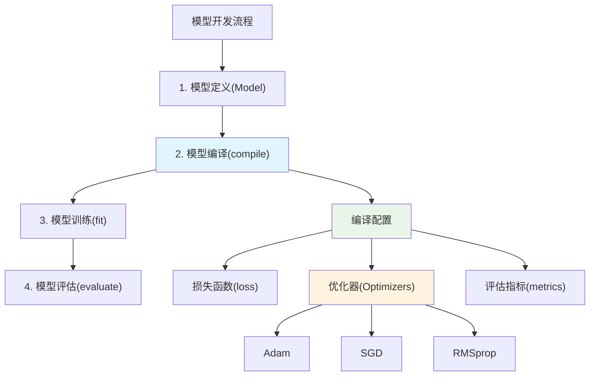

# HCIA-AI 题目分析 - tf.keras网络编译方法与接口

## 题目内容

**问题**: 下列哪些选项属于tf.keras常用的关于网络编译的方法与接口？

**选项**:
- A. Optimizers
- B. evaluate
- C. compile
- D. Model

## 选项分析表格

| 选项 | 内容 | 正确性 | 详细分析 | 知识点 |
|------|------|--------|----------|--------|
| A | Optimizers | ✅ | Optimizers是tf.keras中的优化器模块，用于定义网络训练时的优化算法（如Adam、SGD等），是网络编译时必须指定的重要组件 | 优化器配置 |
| B | evaluate | ❌ | evaluate是模型评估方法，用于在测试集上评估已训练模型的性能，不属于网络编译阶段的方法 | 模型评估 |
| C | compile | ✅ | compile是tf.keras中最核心的网络编译方法，用于配置模型的损失函数、优化器和评估指标 | 模型编译 |
| D | Model | ❌ | Model是tf.keras中的模型类，用于创建和定义网络结构，不是专门的编译方法 | 模型定义 |

## 正确答案
**答案**: AC

**解题思路**: 
1. 理解网络编译的概念：在tf.keras中，网络编译是指配置模型训练所需的损失函数、优化器和评估指标
2. 分析各选项与编译的关系：
   - Optimizers：直接用于编译时指定优化算法
   - compile：核心编译方法
   - evaluate：属于模型使用阶段，非编译阶段
   - Model：属于模型定义阶段，非编译阶段

## 概念图解



## 知识点总结

### 核心概念
- **模型编译**: 在训练前配置模型的学习过程，包括损失函数、优化器和评估指标
- **compile方法**: tf.keras的核心编译接口，语法为model.compile(optimizer, loss, metrics)
- **Optimizers模块**: 提供各种优化算法的实现，如Adam、SGD、RMSprop等

### 相关技术
- **TensorFlow/Keras**: Google开发的深度学习框架
- **优化算法**: 梯度下降的各种变体，用于更新网络权重
- **损失函数**: 衡量模型预测与真实值差异的函数

### 记忆要点
- **编译三要素**: 优化器(optimizer) + 损失函数(loss) + 评估指标(metrics)
- **方法区分**: compile(编译) ≠ evaluate(评估) ≠ fit(训练)
- **常见陷阱**: 不要将模型定义(Model)和模型评估(evaluate)误认为编译方法

## 扩展学习

### 相关文档
- [TensorFlow官方文档 - Model.compile](https://tensorflow.org/api_docs/python/tf/keras/Model#compile)
- [Keras优化器指南](https://keras.io/api/optimizers/)

### 实践应用
- **典型编译示例**: 
  ```python
  model.compile(
      optimizer='adam',
      loss='sparse_categorical_crossentropy',
      metrics=['accuracy']
  )
  ```
- **华为MindSpore对比**: MindSpore中对应的是model.compile()方法，概念类似但API略有差异