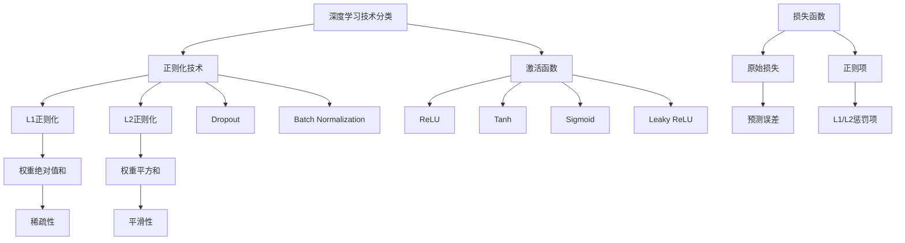

# HCIA-AI 题目分析 - 深度学习正则项

## 题目内容

**问题**: 在深度学习中，以下哪些是常用的正则项？

**选项**:
- A. L1
- B. Tanh
- C. Relu
- D. l2

## 选项分析表格

| 选项 | 内容 | 正确性 | 详细分析 | 知识点 |
|------|------|--------|----------|--------|
| A | L1 | ✅ | L1正则化是常用的正则化技术，通过在损失函数中添加权重绝对值的和来防止过拟合，具有稀疏性特点 | L1正则化 |
| B | Tanh | ❌ | Tanh是激活函数，不是正则项。它用于引入非线性，输出范围为(-1,1) | 激活函数 |
| C | Relu | ❌ | ReLU是激活函数，不是正则项。它用于引入非线性，解决梯度消失问题 | 激活函数 |
| D | l2 | ✅ | L2正则化是最常用的正则化技术，通过在损失函数中添加权重平方和来防止过拟合，也称为权重衰减 | L2正则化 |

## 正确答案
**答案**: AD

**解题思路**: 
1. 理解正则项的定义：用于防止过拟合的技术
2. 区分正则项和激活函数的概念
3. L1和L2是经典的正则化方法
4. Tanh和ReLU是激活函数，不是正则项

## 概念图解



## 知识点总结

### 核心概念
- **L1正则化**: 在损失函数中添加权重绝对值的和，λ∑|w_i|，促进稀疏性
- **L2正则化**: 在损失函数中添加权重平方和，λ∑w_i²，也称为权重衰减
- **正则项vs激活函数**: 正则项用于防止过拟合，激活函数用于引入非线性

### 相关技术
- 正则化参数λ的选择策略
- L1和L2正则化的数学原理
- 其他正则化技术：Dropout、Batch Normalization等
- 激活函数的选择和特性

### 记忆要点
- L1/L2 = 正则项 = 防止过拟合
- Tanh/ReLU = 激活函数 = 引入非线性
- L1促进稀疏性，L2促进平滑性
- 正则化通过惩罚大权重来控制模型复杂度

## 扩展学习

### 相关文档
- 深度学习正则化技术综述
- L1/L2正则化的数学推导
- 激活函数选择指南
- 过拟合与欠拟合的诊断方法

### 实践应用
- 模型正则化策略选择
- 超参数调优中的正则化参数
- 不同正则化方法的组合使用
- 正则化效果的可视化分析

### 代码示例

```python
# L1和L2正则化示例
import tensorflow as tf

# L1正则化
model = tf.keras.Sequential([
    tf.keras.layers.Dense(64, activation='relu',
                         kernel_regularizer=tf.keras.regularizers.l1(0.01)),
    tf.keras.layers.Dense(10, activation='softmax')
])

# L2正则化
model = tf.keras.Sequential([
    tf.keras.layers.Dense(64, activation='relu',
                         kernel_regularizer=tf.keras.regularizers.l2(0.01)),
    tf.keras.layers.Dense(10, activation='softmax')
])

# L1+L2正则化
model = tf.keras.Sequential([
    tf.keras.layers.Dense(64, activation='relu',
                         kernel_regularizer=tf.keras.regularizers.l1_l2(l1=0.01, l2=0.01)),
    tf.keras.layers.Dense(10, activation='softmax')
])

# 损失函数形式
# Loss = Original_Loss + λ₁∑|w_i| + λ₂∑w_i²
```