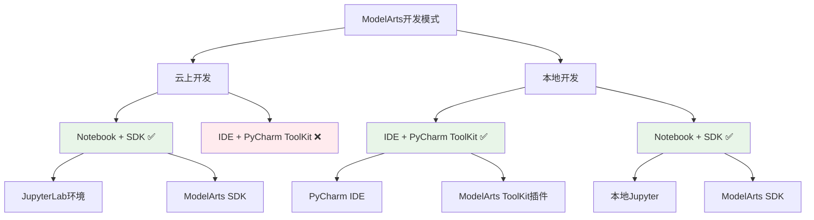

# HCIA-AI 题目分析 - ModelArts训练平台开发模式

## 题目内容

**问题**: ModelArts中训练平台可以支持的开发模式有哪几种？

**选项**:
- A. 云上开发(IDE+PyCharm ToolKit)
- B. 云上开发(Notebook+SDK)
- C. 本地开发(IDE+PyCharm ToolKit)
- D. 本地开发(Notebook+SDK)

## 选项分析表格

| 选项 | 内容 | 正确性 | 详细分析 | 知识点 |
|------|------|--------|----------|--------|
| A | 云上开发(IDE+PyCharm ToolKit) | ❌ | ModelArts不支持云上IDE+PyCharm ToolKit的开发模式，云上主要通过Notebook进行开发 | 云上开发限制 |
| B | 云上开发(Notebook+SDK) | ✅ | ModelArts支持在云上通过Notebook环境结合SDK进行模型开发和训练，这是主要的云上开发方式 | 云上Notebook开发 |
| C | 本地开发(IDE+PyCharm ToolKit) | ✅ | ModelArts支持本地IDE开发，通过PyCharm ToolKit插件可以直接连接ModelArts进行开发和调试 | 本地IDE开发 |
| D | 本地开发(Notebook+SDK) | ✅ | ModelArts支持本地Jupyter Notebook环境结合SDK进行开发，可以在本地编写代码后提交到云端训练 | 本地Notebook开发 |

## 正确答案
**答案**: BCD

**解题思路**: 
1. 理解ModelArts开发模式的分类：按环境分为云上/本地，按工具分为IDE/Notebook
2. 分析各种组合的支持情况：
   - 云上开发：主要支持Notebook+SDK模式
   - 本地开发：支持IDE+PyCharm ToolKit和Notebook+SDK两种模式
3. 排除不支持的组合：云上IDE+PyCharm ToolKit模式不被支持

## 概念图解

## 知识点总结

### 核心概念
- **云上开发**: 在ModelArts云端环境中直接进行模型开发，主要通过Notebook实现
- **本地开发**: 在本地环境开发后提交到ModelArts云端训练，支持多种工具
- **ModelArts SDK**: 华为提供的Python SDK，用于与ModelArts服务交互

### 相关技术
- **JupyterLab**: ModelArts云上提供的交互式开发环境
- **PyCharm ToolKit**: 华为为PyCharm开发的ModelArts集成插件
- **Notebook**: 支持代码、文档、可视化的交互式计算环境

### 记忆要点
- **云上限制**: 云上开发主要通过Notebook，不支持IDE模式
- **本地灵活**: 本地开发支持IDE和Notebook两种方式
- **工具组合**: SDK是必需组件，IDE需要配合ToolKit插件

## 扩展学习

### 相关文档
- [ModelArts开发环境指南](https://support.huaweicloud.com/devtool-modelarts/)
- [PyCharm ToolKit使用指南](https://support.huaweicloud.com/toolkit-modelarts/)

### 实践应用
- **云上开发场景**: 快速原型验证、数据探索分析
- **本地开发场景**: 复杂项目开发、团队协作开发
- **混合开发**: 本地开发+云端训练的混合模式最为常见