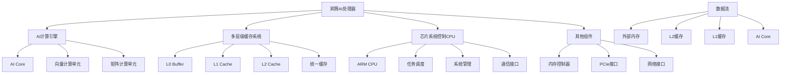

# HCIA-AI 题目分析 - 昇腾AI处理器硬件架构

## 题目内容

**问题**: 昇腾AI处理器主要的硬件架构包括以下哪些选项？

**选项**:
- A. AI计算引擎
- B. 多层级的片上系统缓存或缓冲区
- C. 芯片系统控制CPU
- D. 数字视觉预处理模块

## 选项分析表格

| 选项 | 内容 | 正确性 | 详细分析 | 知识点 |
|------|------|--------|----------|--------|
| A | AI计算引擎 | ✅ | 昇腾处理器的核心组件，包含AI Core等计算单元，负责执行神经网络的矩阵运算和向量计算 | 昇腾架构核心 |
| B | 多层级的片上系统缓存或缓冲区 | ✅ | 昇腾处理器采用多级缓存架构，包括L0、L1、L2缓存等，优化数据访问效率 | 存储层次结构 |
| C | 芯片系统控制CPU | ✅ | 昇腾处理器集成ARM CPU作为系统控制单元，负责任务调度、系统管理和与外部的通信 | 系统控制单元 |
| D | 数字视觉预处理模块 | ❌ | 这不是昇腾AI处理器的标准硬件架构组件，昇腾主要专注于AI计算而非专门的视觉预处理 | 专用处理模块 |

## 正确答案
**答案**: ABC

**解题思路**: 
1. 了解昇腾AI处理器的整体架构设计
2. AI计算引擎是核心计算单元
3. 多层级缓存是性能优化的关键
4. 系统控制CPU负责整体协调
5. 数字视觉预处理不是标准架构组件

## 概念图解



## 知识点总结

### 核心概念
- **AI计算引擎**: 昇腾处理器的核心，包含多个AI Core，专门优化AI计算
- **多层级缓存**: L0/L1/L2等多级缓存架构，减少内存访问延迟
- **系统控制CPU**: ARM架构的控制处理器，负责系统级任务管理
- **异构计算架构**: AI计算单元与通用CPU协同工作

### 相关技术
- 昇腾Da Vinci架构设计原理
- AI Core的计算能力和特性
- 缓存一致性和数据流优化
- 异构计算的任务调度机制

### 记忆要点
- 昇腾 = AI计算引擎 + 多级缓存 + 控制CPU
- AI Core是计算核心，CPU是控制核心
- 多层级缓存优化数据访问性能
- 不包含专门的视觉预处理模块

## 扩展学习

### 相关文档
- 昇腾AI处理器架构白皮书
- Da Vinci架构技术详解
- 华为AI芯片技术发展路线
- 异构计算架构设计原理

### 实践应用
- 昇腾开发板的硬件特性
- AI模型在昇腾上的部署优化
- 缓存优化策略和性能调优
- 昇腾集群的架构设计

### 技术对比

```python
# 昇腾架构特点
ascend_architecture = {
    'ai_compute_engine': {
        'ai_cores': '多个AI Core并行计算',
        'vector_unit': '向量计算优化',
        'matrix_unit': '矩阵运算加速'
    },
    'cache_hierarchy': {
        'l0_buffer': '最快访问，容量小',
        'l1_cache': '中等速度，适中容量',
        'l2_cache': '较大容量，共享访问'
    },
    'control_cpu': {
        'architecture': 'ARM架构',
        'functions': ['任务调度', '系统管理', '通信控制']
    },
    'memory_system': {
        'bandwidth': '高带宽内存访问',
        'latency': '低延迟数据传输'
    }
}
```