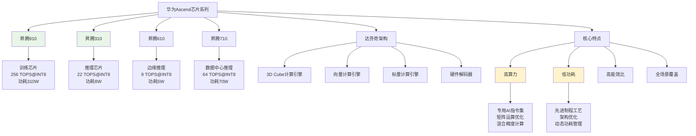

# HCIA-AI 题目分析 - Ascend芯片特点

## 题目内容

**问题**: Ascend芯片是华为设计的AI芯片，其特点是哪几项？

**选项**:
- A. 高功耗
- B. 高算力
- C. 低功耗
- D. 低算力

## 选项分析表格

| 选项 | 内容 | 正确性 | 详细分析 | 知识点 |
|------|------|--------|----------|--------|
| A | 高功耗 | ❌ | 这个描述是错误的。Ascend芯片采用先进的制程工艺和优化的架构设计，具有出色的能效比，功耗控制是其重要优势之一，而不是高功耗 | 芯片功耗特性 |
| B | 高算力 | ✅ | 这个描述是正确的。Ascend芯片专门为AI计算设计，具有强大的AI算力，如昇腾910训练芯片算力可达256 TOPS@INT8，昇腾310推理芯片算力可达22 TOPS@INT8 | AI算力性能 |
| C | 低功耗 | ✅ | 这个描述是正确的。Ascend芯片采用达芬奇架构和先进制程，在保证高性能的同时实现了低功耗设计，这是其相比传统GPU的重要优势 | 能效比优化 |
| D | 低算力 | ❌ | 这个描述是错误的。Ascend芯片是专门为AI计算设计的高性能芯片，具有很强的AI算力，低算力与其设计目标完全相反 | 性能定位 |

## 正确答案
**答案**: BC

**解题思路**: 
1. 理解Ascend芯片的设计目标：高性能AI计算
2. 分析现代AI芯片的发展趋势：高算力 + 低功耗
3. 华为Ascend芯片的核心优势：达芬奇架构带来的高能效比
4. 排除矛盾选项：高功耗与低功耗矛盾，高算力与低算力矛盾

## 概念图解

## 知识点总结

### 核心概念
- **达芬奇架构**: 华为自研的AI芯片架构，针对AI计算进行深度优化
- **高算力**: 专门的AI计算单元，支持多种精度的矩阵运算
- **低功耗**: 通过架构优化和先进制程实现高能效比
- **全场景**: 覆盖训练、推理、边缘、云端等多种应用场景

### Ascend芯片系列对比

| 芯片型号 | 应用场景 | 算力(INT8) | 功耗 | 主要特点 |
|----------|----------|------------|------|----------|
| 昇腾910 | AI训练 | 256 TOPS | 310W | 最强训练性能 |
| 昇腾710 | 数据中心推理 | 64 TOPS | 70W | 高性能推理 |
| 昇腾610 | 边缘推理 | 9 TOPS | 5W | 超低功耗 |
| 昇腾310 | 边缘推理 | 22 TOPS | 8W | 性能功耗平衡 |

### 达芬奇架构特点
- **3D Cube计算引擎**: 专门用于卷积和矩阵运算
- **向量计算引擎**: 处理激活函数等向量运算
- **标量计算引擎**: 处理控制逻辑和标量运算
- **统一缓存架构**: 高效的数据流管理

### 技术优势
- **混合精度计算**: 支持FP32、FP16、INT8等多种精度
- **稀疏计算**: 针对稀疏神经网络的优化
- **动态形状**: 支持动态输入尺寸的模型
- **算子融合**: 自动优化计算图，减少内存访问

### 记忆要点
- **设计理念**: 高性能 + 低功耗 = 高能效比
- **架构特色**: 达芬奇架构专为AI优化
- **产品定位**: 全场景AI芯片解决方案
- **竞争优势**: 自主可控 + 生态完整

## 扩展学习

### 相关技术
- **CANN**: 异构计算架构，Ascend芯片的软件栈
- **MindSpore**: 华为AI框架，与Ascend芯片深度优化
- **ModelArts**: 华为云AI开发平台，支持Ascend芯片
- **Atlas系列**: 基于Ascend芯片的AI计算产品

### 应用场景
- **AI训练**: 使用昇腾910进行大模型训练
- **云端推理**: 使用昇腾710提供AI服务
- **边缘计算**: 使用昇腾310/610进行边缘推理
- **智能终端**: 集成到手机、汽车等终端设备

### 生态系统
- **硬件生态**: Atlas服务器、加速卡、边缘设备
- **软件生态**: CANN、MindSpore、ModelArts
- **开发工具**: MindStudio、MindX SDK
- **行业解决方案**: 智慧城市、自动驾驶、工业AI

### 发展趋势
- **制程升级**: 向更先进制程演进，提升性能功耗比
- **架构演进**: 持续优化达芬奇架构，支持新算法
- **生态完善**: 扩大软件生态，提升开发者体验
- **场景拓展**: 覆盖更多AI应用场景和行业需求