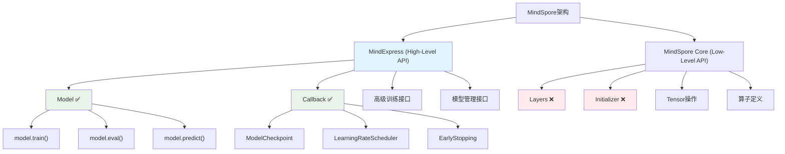

# HCIA-AI 题目分析 - MindExpress High-Level Python API接口

## 题目内容

**问题**: 以下哪几项是MindExpress子系统High-Level Python API提供的功能接口？

**选项**:
- A. Callback
- B. Layers
- C. Initializer
- D. Model

## 选项分析表格

| 选项 | 内容 | 正确性 | 详细分析 | 知识点 |
|------|------|--------|----------|--------|
| A | Callback | ✅ | Callback是MindExpress提供的回调函数接口，用于在训练过程中执行自定义操作，如保存检查点、学习率调度等 | 训练回调机制 |
| B | Layers | ❌ | Layers是低级API组件，属于MindSpore的基础层接口，不是MindExpress High-Level API的直接组成部分 | 网络层定义 |
| C | Initializer | ❌ | Initializer是权重初始化接口，属于底层API范畴，主要用于参数初始化，不是High-Level API的核心接口 | 参数初始化 |
| D | Model | ✅ | Model是MindExpress High-Level API的核心接口，提供了模型的高级抽象，包括训练、评估、推理等功能 | 高级模型接口 |

## 正确答案
**答案**: AD

**解题思路**: 
1. 理解MindExpress的定位：作为MindSpore的高级API层，提供简化的模型开发接口
2. 区分High-Level和Low-Level API：
   - High-Level：面向用户的简化接口，如Model、Callback
   - Low-Level：底层实现接口，如Layers、Initializer
3. 分析各选项的API层级归属

## 概念图解



## 知识点总结

### 核心概念
- **MindExpress**: MindSpore的高级API子系统，提供简化的模型开发接口
- **High-Level API**: 面向最终用户的高级抽象接口，隐藏底层实现细节
- **Model接口**: 提供模型的完整生命周期管理，包括训练、评估、推理
- **Callback机制**: 在训练过程中插入自定义逻辑的钩子函数

### 相关技术
- **MindSpore框架**: 华为自研的深度学习框架
- **API分层设计**: 高级API简化使用，低级API提供灵活性
- **模型抽象**: 将复杂的训练流程封装为简单的接口调用

### 记忆要点
- **API层级区分**: High-Level(Model, Callback) vs Low-Level(Layers, Initializer)
- **MindExpress定位**: 简化MindSpore使用的高级封装层
- **核心组件**: Model(模型管理) + Callback(训练控制)

## 扩展学习

### 相关文档
- [MindSpore官方文档 - MindExpress](https://mindspore.cn/docs/)
- [MindSpore API参考 - Model类](https://mindspore.cn/docs/api/)

### 实践应用
- **Model使用示例**:
  ```python
  from mindspore import Model
  model = Model(network, loss_fn, optimizer, metrics)
  model.train(epoch, train_dataset, callbacks)
  ```
- **Callback应用场景**: 模型检查点保存、训练过程监控、学习率动态调整
- **与TensorFlow对比**: 类似于tf.keras的高级API设计理念