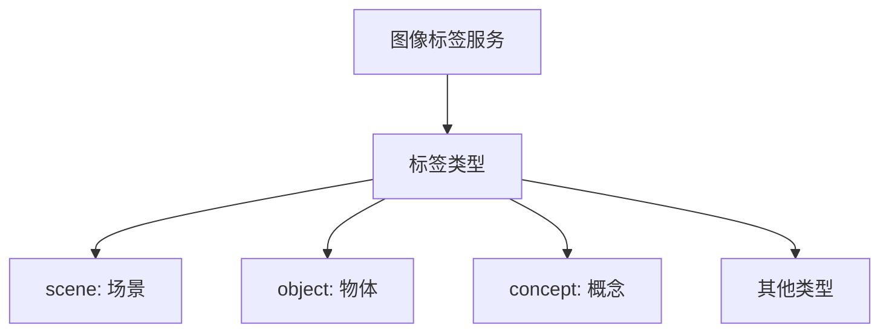

# HCIA-AI 题目分析 - 华为云图像标签服务

## 题目内容

**问题**: 在使用华为云图像标签服务时，image_tagging_asks()函数的返回结果中，type代表什么类型，该标签类型包括以下几种？

**选项**:
- A. virtual
- B. scene
- C. object
- D. concept

## 选项分析表格

| 选项 | 内容 | 正确性 | 详细分析 | 知识点 |
|------|------|--------|----------|--------|
| A | virtual | ❌ | virtual不是图像标签服务的标准标签类型，通常不用于描述图像内容 | 图像标签类型 |
| B | scene | ✅ | scene代表场景标签，如室内、户外等环境描述 | 场景识别 |
| C | object | ✅ | object代表物体标签，识别图像中的具体物体 | 物体检测 |
| D | concept | ✅ | concept代表概念标签，描述抽象概念或高级语义 | 概念提取 |

## 正确答案
**答案**: BCD

**解题思路**: 理解华为云图像标签服务的标签分类系统，排除非标准类型virtual。

## 概念图解 (如需要)

## 知识点总结

### 核心概念
- 图像标签服务的多类型标签系统。

### 相关技术
- 华为云AI服务。

### 记忆要点
- 常见标签类型：scene, object, concept。

## 扩展学习

### 相关文档
- 华为云图像标签服务API文档。

### 实践应用
- 图像内容分析应用。