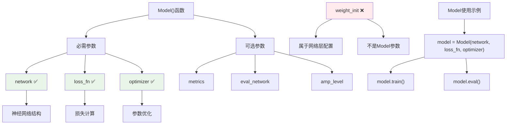

# HCIA-AI 题目分析 - MindSpore Model()函数参数

## 题目内容

**问题**: 以下哪几项是MindSpore中Model()函数的参数？

**选项**:
- A. loss_fn
- B. optimizer
- C. weight_init
- D. network

## 选项分析表格

| 选项 | 内容 | 正确性 | 详细分析 | 知识点 |
|------|------|--------|----------|--------|
| A | loss_fn | ✅ | loss_fn是Model()的核心参数，用于指定损失函数，定义模型训练时的优化目标 | 损失函数配置 |
| B | optimizer | ✅ | optimizer是Model()的必需参数，用于指定优化算法（如Adam、SGD等），控制模型参数的更新方式 | 优化器配置 |
| C | weight_init | ❌ | weight_init不是Model()函数的参数，权重初始化通常在网络层定义时指定，或通过单独的初始化函数处理 | 权重初始化 |
| D | network | ✅ | network是Model()的第一个参数，用于指定要训练的神经网络结构，是Model类的核心组件 | 网络结构定义 |

## 正确答案
**答案**: ABD

**解题思路**: 
1. 理解Model()函数的作用：将网络、损失函数、优化器等组件封装成完整的训练模型
2. 分析Model()的核心参数：
   - network：网络结构（必需）
   - loss_fn：损失函数（训练时必需）
   - optimizer：优化器（训练时必需）
3. 排除非Model()参数：weight_init属于网络层级的配置，不是Model()的直接参数

## 概念图解



## 知识点总结

### 核心概念
- **Model类**: MindSpore中的高级模型封装类，整合网络、损失函数、优化器等组件
- **network参数**: 指定要训练的神经网络结构，通常是继承自nn.Cell的网络对象
- **loss_fn参数**: 损失函数，用于计算预测值与真实值之间的差异
- **optimizer参数**: 优化算法，用于根据梯度更新网络参数

### 相关技术
- **MindSpore框架**: 华为自研的深度学习框架
- **模型封装**: 将训练所需的各个组件统一管理
- **参数分离**: 网络结构定义与模型配置分离的设计模式

### 记忆要点
- **Model三要素**: network(网络) + loss_fn(损失) + optimizer(优化器)
- **参数层级**: Model参数 ≠ 网络层参数(如weight_init)
- **典型用法**: `Model(net, loss, optim, metrics=['accuracy'])`

## 扩展学习

### 相关文档
- [MindSpore官方文档 - Model API](https://mindspore.cn/docs/api/zh-CN/master/api_python/mindspore/mindspore.Model.html)
- [MindSpore模型训练指南](https://mindspore.cn/tutorials/)

### 实践应用
- **完整Model创建示例**:
  ```python
  from mindspore import Model, nn
  
  # 定义网络、损失函数、优化器
  network = MyNet()
  loss_fn = nn.SoftmaxCrossEntropyWithLogits()
  optimizer = nn.Adam(network.trainable_params())
  
  # 创建Model
  model = Model(network, loss_fn, optimizer, metrics=['accuracy'])
  ```
- **权重初始化正确位置**: 在网络定义时或使用单独的初始化函数
- **与TensorFlow对比**: 类似于tf.keras.Model的compile方法参数