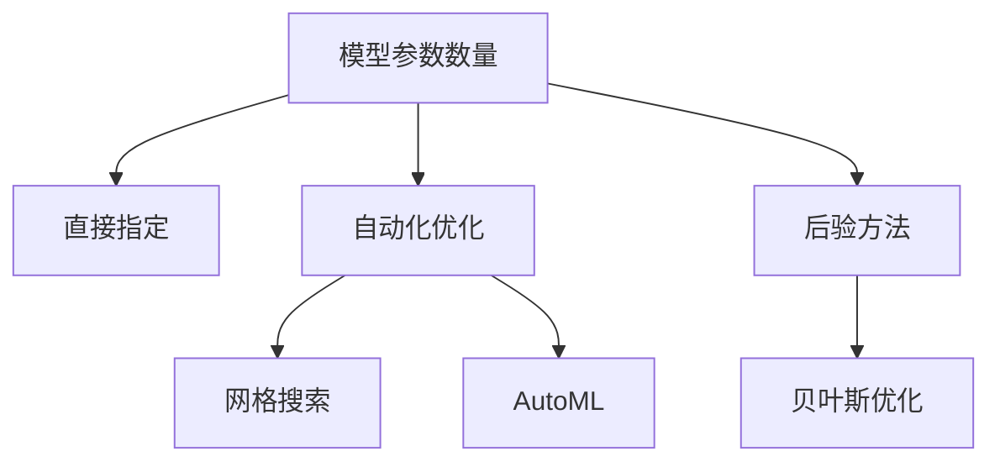

# HCIA-AI 题目分析 - 模型参数数量与计算时间

## 题目内容

**问题**: 以下关于模型参数数量与参数数量的时间选择中，哪些是正确的？

**选项**:
- A. 模型参数数量通常由实验者直接指定
- B. 模型参数数量只能通过人工直接设定
- C. 模型参数数量报告给定的预测规则
- D. 模型参数数量可以使用后发式方法来设定

## 选项分析表格

| 选项 | 内容 | 正确性 | 详细分析 | 知识点 |
|------|------|--------|----------|--------|
| A | 模型参数数量通常由实验者直接指定 | ✅ | 参数数量往往由研究者根据任务需求和计算资源直接选择 | 模型设计 |
| B | 模型参数数量只能通过人工直接设定 | ❌ | 参数数量可以通过自动化方法如网格搜索或AutoML优化 | 参数优化 |
| C | 模型参数数量报告给定的预测规则 | ✅ | 参数数量影响模型的预测规则和复杂度 | 模型复杂度 |
| D | 模型参数数量可以使用后发式方法来设定 | ✅ | 后验方法如贝叶斯优化可用于参数数量的选择 | 超参数调优 |

## 正确答案
**答案**: ACD

**解题思路**: 识别模型参数选择的多种方式，排除唯一人工设定的错误观点。

## 概念图解

## 知识点总结

### 核心概念
- 模型参数数量的选择策略。

### 相关技术
- 超参数优化方法。

### 记忆要点
- 参数数量不限于人工设定，可用自动化和后验方法。

## 扩展学习

### 相关文档
- 机器学习超参数调优指南。

### 实践应用
- 模型复杂度控制。