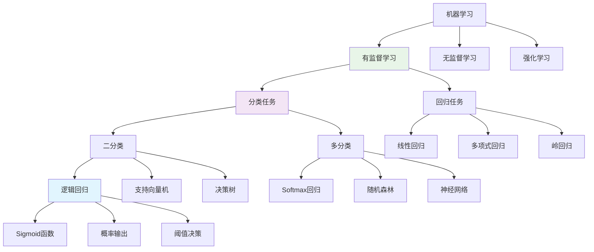

# HCIA-AI 题目分析 - 逻辑回归学习类型

## 题目内容

**问题**: 31. 逻辑回归模型属于有监督学习中的() 模型。(输入中文)(1.00分)

**选项**:
- 填空答案: 分类

## 选项分析表格

| 选项 | 内容 | 正确性 | 详细分析 | 知识点 |
|------|------|--------|----------|--------|
| 分类 | 分类模型 | ✅ | 逻辑回归是典型的分类模型，属于有监督学习。它通过Sigmoid函数将线性回归的连续输出映射到(0,1)区间，表示样本属于正类的概率，然后通过设定阈值(通常0.5)进行二分类决策。虽然名字中有"回归"，但实际上是用于分类任务的算法。 | 有监督学习、分类算法 |

## 正确答案
**答案**: 分类

**解题思路**: 
1. 逻辑回归虽然名字包含"回归"，但实际是分类算法
2. 它属于有监督学习，需要标注的训练数据
3. 输出是离散的类别标签，不是连续数值
4. 主要用于二分类，也可扩展到多分类
5. 题目要求输入中文，答案是"分类"

## 概念图解



## 知识点总结

### 核心概念
- **有监督学习**: 使用标注数据进行训练的机器学习方法
- **分类任务**: 预测离散类别标签的任务
- **逻辑回归**: 基于概率的线性分类算法
- **概率输出**: 输出样本属于各类别的概率

### 机器学习任务分类

#### 按学习方式分类
1. **有监督学习 (Supervised Learning)**
   - 训练数据包含输入和对应的标签
   - 目标是学习输入到输出的映射关系
   - 包括分类和回归任务

2. **无监督学习 (Unsupervised Learning)**
   - 训练数据只有输入，没有标签
   - 目标是发现数据中的隐藏模式
   - 包括聚类、降维、关联规则等

3. **强化学习 (Reinforcement Learning)**
   - 通过与环境交互获得奖励信号
   - 目标是学习最优策略
   - 应用于游戏、机器人控制等

#### 按任务类型分类
1. **分类任务 (Classification)**
   - 输出是离散的类别标签
   - 目标是预测样本属于哪个类别
   - 评估指标：准确率、精确率、召回率、F1分数

2. **回归任务 (Regression)**
   - 输出是连续的数值
   - 目标是预测具体的数值大小
   - 评估指标：MSE、MAE、R²等

### 逻辑回归详解

#### 为什么叫"逻辑回归"？
- **历史原因**: 最初从线性回归发展而来
- **数学形式**: 使用回归的线性组合形式
- **实际功能**: 通过Sigmoid函数转换为分类
- **现代理解**: 应该称为"逻辑分类"更准确

#### 逻辑回归的分类特性
```
线性回归: y = wx + b  (连续输出)
逻辑回归: p = σ(wx + b) = 1/(1+e^(-(wx+b)))  (概率输出)
分类决策: ŷ = 1 if p ≥ 0.5 else 0  (离散输出)
```

#### 与线性回归的对比
| 特征 | 线性回归 | 逻辑回归 |
|------|----------|----------|
| 任务类型 | 回归 | 分类 |
| 输出范围 | (-∞, +∞) | (0, 1) |
| 激活函数 | 无 | Sigmoid |
| 损失函数 | MSE | 交叉熵 |
| 输出解释 | 数值预测 | 概率预测 |

### 有监督学习中的分类算法

#### 常见分类算法
1. **线性分类器**
   - 逻辑回归
   - 线性判别分析(LDA)
   - 感知机

2. **非线性分类器**
   - 支持向量机(SVM)
   - 决策树
   - 随机森林
   - 神经网络

3. **概率分类器**
   - 朴素贝叶斯
   - 高斯混合模型
   - 逻辑回归

4. **集成方法**
   - 随机森林
   - AdaBoost
   - 梯度提升树(GBDT)
   - XGBoost

#### 分类任务的类型
1. **二分类 (Binary Classification)**
   - 只有两个类别
   - 逻辑回归的经典应用
   - 示例：垃圾邮件检测、医疗诊断

2. **多分类 (Multi-class Classification)**
   - 多个互斥类别
   - 可用Softmax回归
   - 示例：图像识别、文本分类

3. **多标签分类 (Multi-label Classification)**
   - 每个样本可属于多个类别
   - 需要特殊处理方法
   - 示例：标签推荐、基因功能预测

### 逻辑回归的扩展

#### 多分类扩展
1. **一对一 (One-vs-One)**
   - 每两个类别训练一个分类器
   - 需要C(n,2)个分类器

2. **一对多 (One-vs-Rest)**
   - 每个类别对其他所有类别
   - 需要n个分类器

3. **Softmax回归**
   - 逻辑回归的直接多分类扩展
   - 输出所有类别的概率分布

#### Softmax回归公式
```
P(y=k|x) = exp(w_k^T x) / Σ exp(w_j^T x)

其中:
- k: 类别索引
- w_k: 第k类的权重向量
- x: 输入特征向量
```

### 记忆要点
- 逻辑回归 = 分类算法，不是回归算法
- 有监督学习需要标注数据
- 分类输出离散标签，回归输出连续数值
- 逻辑回归通过Sigmoid函数实现分类
- 名字有误导性，实际是分类模型

## 扩展学习

### 实际应用场景

#### 二分类应用
- **医疗诊断**: 疾病/健康
- **金融风控**: 违约/正常
- **营销分析**: 购买/不购买
- **垃圾邮件**: 垃圾/正常
- **推荐系统**: 点击/不点击

#### 多分类应用
- **图像识别**: 物体类别识别
- **文本分类**: 新闻主题分类
- **语音识别**: 音素识别
- **情感分析**: 正面/中性/负面

### 代码实现示例

#### Scikit-learn实现
```python
from sklearn.linear_model import LogisticRegression
from sklearn.model_selection import train_test_split
from sklearn.metrics import accuracy_score, classification_report

# 创建逻辑回归模型
model = LogisticRegression()

# 训练模型
X_train, X_test, y_train, y_test = train_test_split(X, y, test_size=0.2)
model.fit(X_train, y_train)

# 预测
y_pred = model.predict(X_test)
y_proba = model.predict_proba(X_test)  # 概率输出

# 评估
accuracy = accuracy_score(y_test, y_pred)
print(f"准确率: {accuracy}")
print(classification_report(y_test, y_pred))
```

#### MindSpore实现
```python
import mindspore as ms
import mindspore.nn as nn
import mindspore.ops as ops

class LogisticRegression(nn.Cell):
    def __init__(self, input_dim, num_classes=1):
        super(LogisticRegression, self).__init__()
        self.linear = nn.Dense(input_dim, num_classes)
        self.sigmoid = nn.Sigmoid()
    
    def construct(self, x):
        out = self.linear(x)
        if self.num_classes == 1:
            out = self.sigmoid(out)  # 二分类
        else:
            out = nn.Softmax(axis=1)(out)  # 多分类
        return out

# 使用示例
model = LogisticRegression(input_dim=10)
loss_fn = nn.BCELoss()  # 二分类交叉熵损失
optimizer = nn.Adam(model.trainable_params(), learning_rate=0.01)
```

### 模型评估

#### 分类评估指标
1. **准确率 (Accuracy)**
   ```
   Accuracy = (TP + TN) / (TP + TN + FP + FN)
   ```

2. **精确率 (Precision)**
   ```
   Precision = TP / (TP + FP)
   ```

3. **召回率 (Recall)**
   ```
   Recall = TP / (TP + FN)
   ```

4. **F1分数**
   ```
   F1 = 2 × (Precision × Recall) / (Precision + Recall)
   ```

5. **AUC-ROC**
   - ROC曲线下的面积
   - 衡量分类器的整体性能

#### 混淆矩阵
```
实际\预测    正类    负类
正类        TP     FN
负类        FP     TN
```

### 优化和改进

#### 正则化
- **L1正则化**: 特征选择，产生稀疏解
- **L2正则化**: 防止过拟合，参数平滑
- **弹性网络**: 结合L1和L2正则化

#### 特征工程
- **特征选择**: 选择最相关的特征
- **特征变换**: 多项式特征、交互特征
- **特征缩放**: 标准化、归一化

#### 超参数调优
- **学习率**: 控制收敛速度
- **正则化强度**: 平衡拟合和泛化
- **迭代次数**: 确保充分收敛
- **求解器**: 选择合适的优化算法