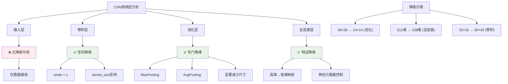

# HCIA-AI 题目分析 - 卷积神经网络降维层分析

## 题目内容

**问题**: 在卷积神经网络中，不同层具有不同的功能，可以起到降维作用的是以下哪一层？

**选项**:
- A. 输入层
- B. 全连接层
- C. 卷积层
- D. 池化层

## 选项分析表格

| 选项 | 内容 | 正确性 | 详细分析 | 知识点 |
|------|------|--------|----------|--------|
| A | 输入层 | ❌ | 输入层只是接收原始数据，不进行任何变换或降维操作，维度由输入数据本身决定 | 数据输入 |
| B | 全连接层 | ✅ | 全连接层可以将高维特征映射到低维空间，通过调整输出神经元数量实现降维，常用于分类前的特征压缩 | 特征降维 |
| C | 卷积层 | ✅ | 卷积层通过卷积操作可以减少空间维度，特别是使用大于1的步长(stride)时，能够有效降低特征图的空间分辨率 | 空间降维 |
| D | 池化层 | ✅ | 池化层是专门的降维层，通过最大池化或平均池化操作显著减少特征图的空间维度，同时保留重要特征 | 池化降维 |

## 正确答案
**答案**: BCD

**解题思路**: 
1. 理解降维的概念：减少数据的维度或特征图的尺寸
2. 分析各层的功能特点：
   - 输入层：仅接收数据，无变换
   - 全连接层：可通过神经元数量控制输出维度
   - 卷积层：通过步长和卷积核大小影响输出尺寸
   - 池化层：专门用于降采样和降维
3. 识别具有降维能力的层

## 概念图解



## 知识点总结

### 核心概念
- **空间降维**: 减少特征图的空间尺寸(高度×宽度)
- **特征降维**: 减少特征向量的维度数量
- **池化降维**: 通过池化操作进行下采样，是最直接的降维方法
- **卷积降维**: 通过步长和卷积核参数控制输出尺寸

### 相关技术
- **池化操作**: MaxPooling、AvgPooling、GlobalPooling
- **卷积参数**: stride(步长)、padding(填充)、kernel_size(卷积核大小)
- **全连接映射**: 线性变换实现维度转换

### 记忆要点
- **降维三剑客**: 池化层(专门)、卷积层(可选)、全连接层(灵活)
- **输入层特点**: 只接收不变换，无降维功能
- **池化最直接**: 专门设计用于降维，效果最明显
- **参数控制**: stride>1、较大kernel_size可实现卷积降维

## 扩展学习

### 相关文档
- [CNN架构设计原理](https://cs231n.github.io/convolutional-networks/)
- [池化层详解](https://pytorch.org/docs/stable/nn.html#pooling-layers)

### 实践应用
- **典型降维流程**: 
  ```
  输入(224×224) → 卷积(stride=2) → 池化(2×2) → 全连接(1000→100)
  ```
- **降维策略选择**: 
  - 保留空间信息：使用stride卷积
  - 快速降维：使用池化层
  - 特征压缩：使用全连接层
- **华为昇腾优化**: 在昇腾AI芯片上，池化操作有专门的硬件加速支持