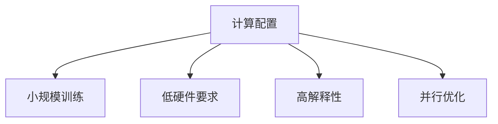

# HCIA-AI 题目分析 - 计算配置

## 题目内容

**问题**: 以下选项中，哪些是开始计算的正确配置？

**选项**:
- A. 适合小规模量训练，增加计算量以提升并行计算
- B. 对计算机硬件要求较低，一般不需要GPU显卡支持计算
- C. 人工进行特征选择
- D. 特征可能解释性强

## 选项分析表格

| 选项 | 内容 | 正确性 | 详细分析 | 知识点 |
|------|------|--------|----------|--------|
| A | 适合小规模量训练，增加计算量以提升并行计算 | ✅ | 正确描述了某些计算配置的优势，如分布式计算 | 计算优化 |
| B | 对计算机硬件要求较低，一般不需要GPU显卡支持计算 | ✅ | 一些配置对硬件要求低，无需GPU | 硬件需求 |
| C | 人工进行特征选择 | ❌ | 通常自动化特征选择，而非人工 | 特征工程 |
| D | 特征可能解释性强 | ✅ | 配置可能提供高解释性特征 | 模型解释性 |

## 正确答案
**答案**: ABD

**解题思路**: 评估计算配置的正确性和适用性，排除人工干预的选项。

## 概念图解

## 知识点总结

### 核心概念
- 计算配置的选择标准。

### 相关技术
- 并行计算和硬件优化。

### 记忆要点
- 适合小规模、低硬件、高解释性。

## 扩展学习

### 相关文档
- 计算资源配置指南。

### 实践应用
- 训练环境设置。