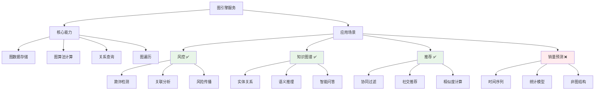

# HCIA-AI 题目分析 - 图引擎服务应用场景

## 题目内容

**问题**: 下列哪几项是图引擎服务可以应用的场景？

**选项**:
- A. 风控
- B. 销量预测
- C. 知识图谱
- D. 推荐

## 选项分析表格

| 选项 | 内容 | 正确性 | 详细分析 | 知识点 |
|------|------|--------|----------|--------|
| A | 风控 | ✅ | 图引擎在金融风控中广泛应用，通过构建用户关系图、资金流向图等，识别欺诈团伙和异常交易模式 | 金融风控图分析 |
| B | 销量预测 | ❌ | 销量预测主要基于时间序列分析、回归模型等统计方法，不是图引擎的典型应用场景 | 时间序列预测 |
| C | 知识图谱 | ✅ | 知识图谱是图引擎的核心应用场景，通过图数据库存储和查询实体间的复杂关系，支持智能问答和推理 | 知识图谱构建 |
| D | 推荐 | ✅ | 推荐系统中图引擎用于建模用户-物品关系、社交网络关系，实现基于图的协同过滤和社交推荐 | 图推荐算法 |

## 正确答案
**答案**: ACD

**解题思路**: 
1. 理解图引擎的核心特点：处理复杂关系数据，支持图遍历和图算法
2. 分析各应用场景的数据特征：
   - 风控：需要分析复杂的关联关系
   - 销量预测：主要是数值型时间序列数据
   - 知识图谱：典型的图结构数据
   - 推荐：涉及用户、物品、行为的多重关系
3. 匹配图引擎适用的关系型场景

## 概念图解

## 知识点总结

### 核心概念
- **图引擎**: 专门处理图结构数据的计算引擎，支持复杂关系查询和图算法
- **图数据库**: 以图结构存储数据，节点表示实体，边表示关系
- **图算法**: PageRank、社区发现、最短路径等专门的图计算算法

### 相关技术
- **华为图引擎GES**: 华为云提供的图数据库服务
- **Neo4j**: 主流的图数据库产品
- **图计算框架**: GraphX、Giraph等分布式图计算平台

### 记忆要点
- **图引擎三大场景**: 风控(关联分析) + 知识图谱(关系推理) + 推荐(协同过滤)
- **非图场景**: 销量预测等时间序列问题不适合图引擎
- **关系导向**: 图引擎擅长处理"谁与谁有关系"的问题

## 扩展学习

### 相关文档
- [华为云图引擎服务GES](https://support.huaweicloud.com/ges/)
- [图数据库应用场景指南](https://neo4j.com/use-cases/)

### 实践应用
- **风控场景**: 构建用户-设备-IP关系图，识别团伙欺诈
- **知识图谱**: 构建企业知识库，支持智能客服和决策支持
- **推荐系统**: 基于用户行为图和社交关系图的混合推荐
- **华为生态**: 结合ModelArts进行图神经网络训练