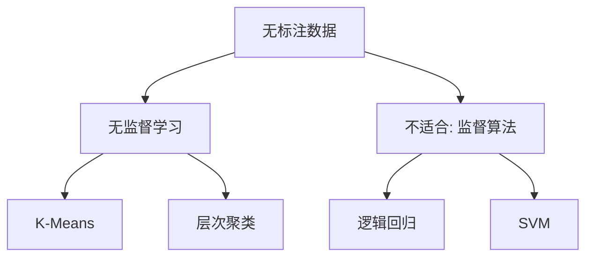

# HCIA-AI 题目分析 - 大数据销售算法

## 题目内容

**问题**: 有大量销售数据，但是没有标注的情况下，企业想细分出VIP客户，以下模型中合适的有哪些？

**选项**:
- A. 逻辑回归
- B. SVM
- C. K-Means
- D. 层次聚类

## 选项分析表格

| 选项 | 内容 | 正确性 | 详细分析 | 知识点 |
|------|------|--------|----------|--------|
| A | 逻辑回归 | ❌ | 逻辑回归是监督学习算法，需要标注数据 | 监督学习 |
| B | SVM | ❌ | SVM也是监督学习算法，需要标签 | 监督学习 |
| C | K-Means | ✅ | K-Means是无监督聚类算法，适合细分客户群 | 无监督学习 |
| D | 层次聚类 | ✅ | 层次聚类是无监督算法，可用于客户分层 | 无监督学习 |

## 正确答案
**答案**: CD

**解题思路**: 在无标注数据下，选择无监督聚类算法进行客户细分。

## 概念图解

## 知识点总结

### 核心概念
- 无监督学习在客户细分中的应用。

### 相关技术
- 聚类算法比较。

### 记忆要点
- 无标签数据用聚类：K-Means, 层次聚类。

## 扩展学习

### 相关文档
- 无监督学习算法概述。

### 实践应用
- 客户关系管理。