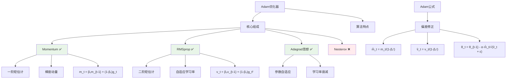

# HCIA-AI 题目分析 - Adam优化器组成

## 题目内容

**问题**: Adam优化器可以看做是以下哪几项的结合？

**选项**:
- A. Momentum
- B. Adagrad
- C. Nesterov
- D. RMSprop

## 选项分析表格

| 选项 | 内容 | 正确性 | 详细分析 | 知识点 |
|------|------|--------|----------|--------|
| A | Momentum | ✅ | Adam结合了Momentum的思想，使用一阶矩估计(梯度的指数移动平均)来保持梯度的动量，加速收敛 | 动量优化 |
| B | Adagrad | ✅ | Adam借鉴了Adagrad的自适应学习率思想，通过二阶矩估计(梯度平方的指数移动平均)来自适应调整每个参数的学习率 | 自适应学习率 |
| C | Nesterov | ❌ | Nesterov加速梯度法虽然是动量方法的改进，但不是Adam的直接组成部分，Adam主要结合的是标准Momentum | Nesterov加速 |
| D | RMSprop | ✅ | Adam可以看作是Momentum和RMSprop的结合，RMSprop提供了二阶矩估计的思想，Adam在此基础上加入了偏差修正 | RMSprop算法 |

## 正确答案
**答案**: ABD

**解题思路**: 
1. 理解Adam算法的核心思想：结合一阶矩(动量)和二阶矩(自适应学习率)
2. 分析Adam的算法来源：
   - Momentum：提供一阶矩估计，保持梯度动量
   - Adagrad：提供自适应学习率的基础思想
   - RMSprop：改进Adagrad的二阶矩估计方法
3. 排除非直接组成部分：Nesterov虽然相关但不是Adam的直接组成

## 概念图解



## 知识点总结

### 核心概念
- **Adam算法**: Adaptive Moment Estimation，自适应矩估计优化算法
- **一阶矩**: 梯度的指数移动平均，来源于Momentum思想
- **二阶矩**: 梯度平方的指数移动平均，来源于RMSprop/Adagrad思想
- **偏差修正**: Adam特有的修正机制，解决初始化偏差问题

### 相关技术
- **优化器家族**: SGD → Momentum → Adagrad → RMSprop → Adam
- **超参数**: β₁(动量系数,0.9) β₂(二阶矩系数,0.999) α(学习率) ε(数值稳定项)
- **变体算法**: AdamW、Adamax、Nadam等

### 记忆要点
- **Adam = Momentum + RMSprop + 偏差修正**
- **三个来源**: Momentum(动量) + Adagrad(自适应思想) + RMSprop(二阶矩)
- **排除项**: Nesterov不是Adam的直接组成部分
- **公式记忆**: 一阶矩m_t + 二阶矩v_t + 偏差修正 + 参数更新

## 扩展学习

### 相关文档
- [Adam论文原文](https://arxiv.org/abs/1412.6980)
- [优化器对比分析](https://ruder.io/optimizing-gradient-descent/)

### 实践应用
- **默认选择**: Adam是深度学习中最常用的优化器
- **超参数设置**: 
  ```python
  optimizer = torch.optim.Adam(params, lr=0.001, betas=(0.9, 0.999))
  ```
- **适用场景**: 大多数深度学习任务，特别是稀疏梯度场景
- **华为MindSpore**: `mindspore.nn.Adam()`提供相同功能