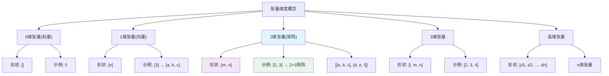

# HCIA-AI 题目分析 - 张量维度计算

## 题目内容

**问题**: 34. 张量[2, 3]是() 维张量。(请填写阿拉伯数字)(1.00分)

**选项**:
- 填空答案: 2

## 选项分析表格

| 选项 | 内容 | 正确性 | 详细分析 | 知识点 |
|------|------|--------|----------|--------|
| 2 | 二维张量 | ✅ | 张量[2, 3]表示一个2×3的矩阵，具有2个维度：第一个维度大小为2(行数)，第二个维度大小为3(列数)。张量的维度数等于其形状(shape)中元素的个数。[2, 3]包含2个元素，因此是2维张量。这可以理解为一个2行3列的矩阵。 | 张量、维度、矩阵 |

## 正确答案
**答案**: 2

**解题思路**: 
1. 张量的维度数由其形状(shape)中的元素个数决定
2. 张量[2, 3]的形状包含2个数字：2和3
3. 因此这是一个2维张量
4. 具体表示一个2行3列的矩阵

## 概念图解



## 知识点总结

### 核心概念
- **张量(Tensor)**: 多维数组的数学概念，是标量、向量、矩阵的推广
- **维度(Dimension)**: 张量的轴数，等于形状中元素的个数
- **形状(Shape)**: 描述张量各个维度大小的元组
- **秩(Rank)**: 张量的维度数，与线性代数中矩阵的秩不同

### 张量维度分类

#### 0维张量(标量)
- **形状**: []
- **示例**: 5, 3.14, -2
- **特点**: 只有一个数值，没有方向
- **应用**: 损失值、学习率等单一数值

#### 1维张量(向量)
- **形状**: [n]
- **示例**: [1, 2, 3, 4, 5] → 形状[5]
- **特点**: 有长度和方向
- **应用**: 特征向量、权重向量

#### 2维张量(矩阵)
- **形状**: [m, n]
- **示例**: [[1, 2, 3], [4, 5, 6]] → 形状[2, 3]
- **特点**: 有行和列
- **应用**: 图像(灰度)、全连接层权重

#### 3维张量
- **形状**: [l, m, n]
- **示例**: RGB图像 → 形状[height, width, channels]
- **特点**: 立体结构
- **应用**: 彩色图像、时间序列数据

#### 4维张量
- **形状**: [batch, height, width, channels]
- **示例**: 批量图像数据
- **应用**: 深度学习中的批量数据

### 张量[2, 3]详解

#### 数学表示
```
张量T的形状为[2, 3]，可以表示为：

T = [[t₁₁, t₁₂, t₁₃],
     [t₂₁, t₂₂, t₂₃]]

其中：
- 第一维(行): 2个元素
- 第二维(列): 3个元素
- 总元素个数: 2 × 3 = 6
```

#### 索引访问
```
- T[0, 0] = t₁₁  (第1行第1列)
- T[0, 1] = t₁₂  (第1行第2列)
- T[0, 2] = t₁₃  (第1行第3列)
- T[1, 0] = t₂₁  (第2行第1列)
- T[1, 1] = t₂₂  (第2行第2列)
- T[1, 2] = t₂₃  (第2行第3列)
```

### 维度计算规则

#### 基本规则
- **维度数 = 形状元组的长度**
- **总元素数 = 形状各维度的乘积**

#### 示例对比
| 张量形状 | 维度数 | 总元素数 | 类型 |
|----------|--------|----------|------|
| [] | 0 | 1 | 标量 |
| [5] | 1 | 5 | 向量 |
| [2, 3] | 2 | 6 | 矩阵 |
| [2, 3, 4] | 3 | 24 | 3维张量 |
| [2, 3, 4, 5] | 4 | 120 | 4维张量 |

### 深度学习中的常见张量形状

#### 图像数据
- **灰度图像**: [height, width] → 2维
- **彩色图像**: [height, width, channels] → 3维
- **批量图像**: [batch_size, height, width, channels] → 4维

#### 文本数据
- **词向量**: [vocab_size] → 1维
- **句子**: [sequence_length, embedding_dim] → 2维
- **批量句子**: [batch_size, sequence_length, embedding_dim] → 3维

#### 网络权重
- **全连接层**: [input_dim, output_dim] → 2维
- **卷积核**: [out_channels, in_channels, kernel_h, kernel_w] → 4维

### 记忆要点
- 维度数 = 形状中数字的个数
- [2, 3] 有2个数字，所以是2维
- 不要与矩阵的行列数混淆
- 张量的"维度"指的是轴的数量，不是空间维度

## 扩展学习

### 编程实现

#### NumPy示例
```python
import numpy as np

# 创建2维张量[2, 3]
tensor_2d = np.array([[1, 2, 3],
                      [4, 5, 6]])

print(f"形状: {tensor_2d.shape}")      # (2, 3)
print(f"维度数: {tensor_2d.ndim}")     # 2
print(f"总元素数: {tensor_2d.size}")   # 6
print(f"数据类型: {tensor_2d.dtype}")  # int64
```

#### MindSpore示例
```python
import mindspore as ms
import mindspore.numpy as mnp

# 创建2维张量[2, 3]
tensor_2d = ms.Tensor([[1, 2, 3],
                       [4, 5, 6]], dtype=ms.float32)

print(f"形状: {tensor_2d.shape}")      # (2, 3)
print(f"维度数: {len(tensor_2d.shape)}") # 2
print(f"总元素数: {tensor_2d.size}")   # 6
```

#### PyTorch示例
```python
import torch

# 创建2维张量[2, 3]
tensor_2d = torch.tensor([[1, 2, 3],
                          [4, 5, 6]])

print(f"形状: {tensor_2d.shape}")      # torch.Size([2, 3])
print(f"维度数: {tensor_2d.dim()}")     # 2
print(f"总元素数: {tensor_2d.numel()}") # 6
```

### 张量操作

#### 形状变换
```python
# 原始张量 [2, 3]
original = np.array([[1, 2, 3], [4, 5, 6]])

# 重塑为 [3, 2]
reshaped = original.reshape(3, 2)
# [[1, 2],
#  [3, 4],
#  [5, 6]]

# 重塑为 [6] (1维)
flattened = original.reshape(6)
# [1, 2, 3, 4, 5, 6]

# 重塑为 [1, 2, 3] (3维)
expanded = original.reshape(1, 2, 3)
# [[[1, 2, 3],
#   [4, 5, 6]]]
```

#### 维度操作
```python
# 增加维度
expanded = np.expand_dims(original, axis=0)  # [1, 2, 3]
expanded = np.expand_dims(original, axis=2)  # [2, 3, 1]

# 减少维度(如果该维度大小为1)
squeezed = np.squeeze(expanded)  # 移除大小为1的维度

# 转置
transposed = original.T  # [3, 2]
```

### 实际应用场景

#### 图像处理
```python
# 灰度图像: [height, width]
gray_image = np.random.rand(224, 224)  # 2维

# RGB图像: [height, width, channels]
rgb_image = np.random.rand(224, 224, 3)  # 3维

# 批量图像: [batch, height, width, channels]
batch_images = np.random.rand(32, 224, 224, 3)  # 4维
```

#### 自然语言处理
```python
# 词嵌入矩阵: [vocab_size, embedding_dim]
embedding_matrix = np.random.rand(10000, 300)  # 2维

# 句子表示: [sequence_length, embedding_dim]
sentence = np.random.rand(20, 300)  # 2维

# 批量句子: [batch_size, sequence_length, embedding_dim]
batch_sentences = np.random.rand(32, 20, 300)  # 3维
```

### 常见错误和注意事项

1. **混淆维度数和维度大小**
   - 维度数：轴的数量
   - 维度大小：每个轴的长度

2. **索引越界**
   - 确保索引在有效范围内
   - 使用负索引时要小心

3. **形状不匹配**
   - 矩阵运算时注意形状兼容性
   - 广播机制的理解和应用

4. **内存效率**
   - 大张量的内存占用
   - 适当的数据类型选择