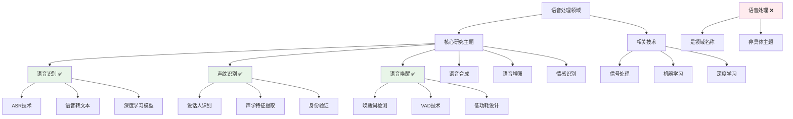

# HCIA-AI 题目分析 - 语音处理研究主题

## 题目内容

**问题**: 以下哪些是语音处理研究的主题？

**选项**:
- A. 语音处理
- B. 声纹识别
- C. 语音识别
- D. 语音唤醒

## 选项分析表格

| 选项 | 内容 | 正确性 | 详细分析 | 知识点 |
|------|------|--------|----------|--------|
| A | 语音处理 | ❌ | 语音处理本身是一个大的研究领域，不是具体的研究主题，而是包含多个子领域的总称 | 语音处理概念 |
| B | 声纹识别 | ✅ | 声纹识别是语音处理的重要研究主题，通过分析语音的声学特征来识别说话人身份 | 说话人识别 |
| C | 语音识别 | ✅ | 语音识别(ASR)是语音处理的核心研究主题，将语音信号转换为文本，是语音技术的基础应用 | 自动语音识别 |
| D | 语音唤醒 | ✅ | 语音唤醒(Voice Activity Detection/Wake Word Detection)是语音处理的重要研究主题，用于检测特定唤醒词 | 语音激活检测 |

## 正确答案
**答案**: BCD

**解题思路**: 
1. 理解语音处理的层次结构：语音处理是总领域，包含多个具体研究主题
2. 区分领域名称和具体主题：
   - 语音处理：领域名称，不是具体主题
   - 声纹识别、语音识别、语音唤醒：具体的研究主题
3. 识别语音处理的主要研究方向和应用场景

## 概念图解

## 知识点总结

### 核心概念
- **语音识别(ASR)**: 将语音信号转换为文本的技术，是语音处理的核心应用
- **声纹识别**: 通过语音特征识别说话人身份，用于身份验证和安全认证
- **语音唤醒**: 检测特定唤醒词或语音活动，常用于智能设备的语音激活
- **语音处理**: 整个研究领域的总称，包含多个具体研究主题

### 相关技术
- **深度学习模型**: Transformer、RNN、CNN在语音处理中的应用
- **特征提取**: MFCC、Mel频谱、声学特征等
- **端到端模型**: 直接从原始语音到目标输出的模型设计

### 记忆要点
- **具体主题三要素**: 语音识别(转文本) + 声纹识别(识别人) + 语音唤醒(检测词)
- **层次区分**: 语音处理(领域) ≠ 具体研究主题
- **应用场景**: 智能音箱、语音助手、安全验证、会议转录

## 扩展学习

### 相关文档
- [语音识别技术综述](https://arxiv.org/abs/1909.06317)
- [华为云语音服务文档](https://support.huaweicloud.com/sis/)

### 实践应用
- **语音识别**: 智能客服、会议记录、语音输入法
- **声纹识别**: 银行身份验证、智能门锁、安全系统
- **语音唤醒**: "小爱同学"、"Hey Siri"、智能家居控制
- **华为生态**: 华为云SIS语音交互服务，支持多种语音处理能力