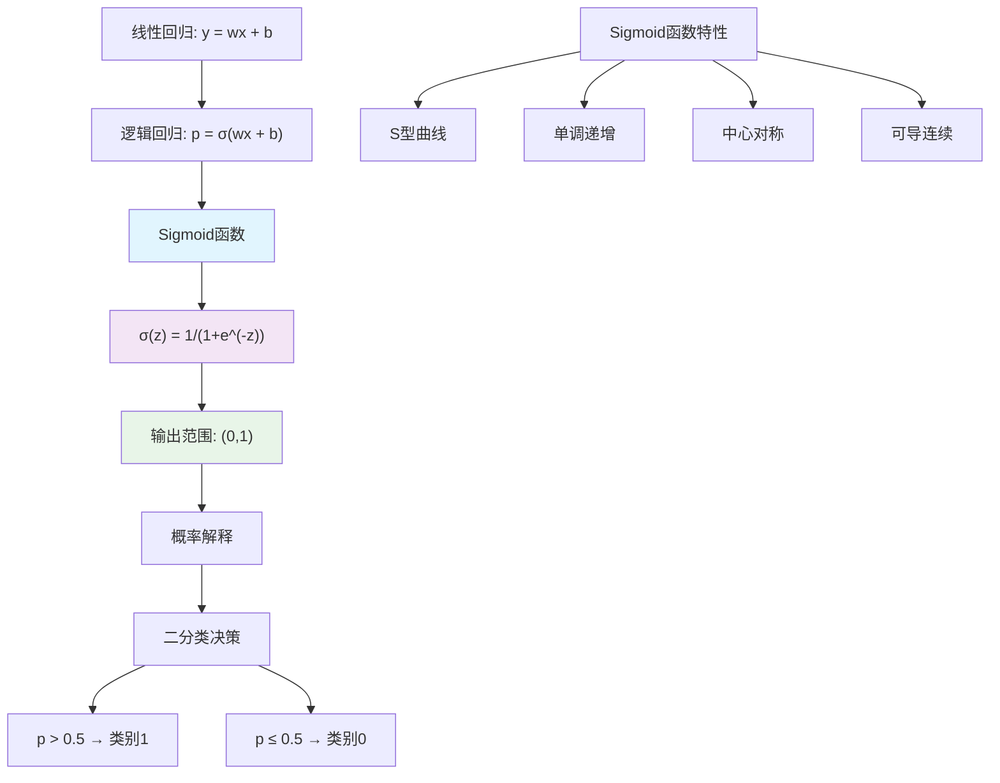

# HCIA-AI 题目分析 - 逻辑回归激活函数

## 题目内容

**问题**: 35. 逻辑回归模型是一种分类模型，用来解决分类问题，其在线性回归基础上引入了非线性因素，() 函数，并设定了阈值，二分类问题。(请输入英文)(1.00分)

**选项**:
- 填空答案: sigmoid

## 选项分析表格

| 选项 | 内容 | 正确性 | 详细分析 | 知识点 |
|------|------|--------|----------|--------|
| sigmoid | Sigmoid函数 | ✅ | Sigmoid函数是逻辑回归模型的核心激活函数，将线性回归的输出映射到(0,1)区间，使其可以表示概率。其数学表达式为σ(z) = 1/(1+e^(-z))，具有S型曲线特征，在z=0处输出0.5，常用0.5作为二分类的决策阈值。Sigmoid函数的引入使得线性模型能够处理非线性分类问题。 | 逻辑回归、激活函数、二分类 |

## 正确答案
**答案**: sigmoid

**解题思路**: 
1. 逻辑回归是在线性回归基础上的分类模型
2. 需要引入非线性函数将线性输出转换为概率
3. Sigmoid函数能将任意实数映射到(0,1)区间
4. 通常设定0.5为分类阈值进行二分类
5. 题目要求输入英文，答案是sigmoid

## 概念图解



## 知识点总结

### 核心概念
- **逻辑回归**: 基于线性回归的分类算法
- **Sigmoid函数**: 将实数映射到(0,1)区间的激活函数
- **概率输出**: 输出表示样本属于正类的概率
- **决策阈值**: 通常使用0.5作为二分类的判决边界

### Sigmoid函数详解

#### 数学表达式
```
σ(z) = 1 / (1 + e^(-z))

其中:
- z = wx + b (线性组合)
- w: 权重向量
- x: 输入特征
- b: 偏置项
```

#### 函数特性
- **定义域**: (-∞, +∞)
- **值域**: (0, 1)
- **单调性**: 严格单调递增
- **对称性**: 关于点(0, 0.5)中心对称
- **边界行为**: 
  - lim(z→+∞) σ(z) = 1
  - lim(z→-∞) σ(z) = 0
  - σ(0) = 0.5

#### 导数特性
```
σ'(z) = σ(z) × (1 - σ(z))
```
- 导数形式简洁，便于梯度计算
- 最大导数值在z=0处，为0.25
- 当|z|很大时，导数接近0(梯度消失)

### 逻辑回归模型

#### 模型假设
```
h(x) = σ(θ^T x) = 1 / (1 + e^(-θ^T x))

其中:
- h(x): 预测概率
- θ: 参数向量
- x: 特征向量
```

#### 决策规则
```
y_pred = {
    1, if h(x) ≥ 0.5
    0, if h(x) < 0.5
}
```

#### 损失函数(对数似然)
```
J(θ) = -1/m × Σ[y*log(h(x)) + (1-y)*log(1-h(x))]
```

### 与其他激活函数对比

| 函数 | 表达式 | 值域 | 特点 | 应用 |
|------|--------|------|------|------|
| Sigmoid | 1/(1+e^(-z)) | (0,1) | S型，概率解释 | 逻辑回归，二分类输出层 |
| Tanh | (e^z-e^(-z))/(e^z+e^(-z)) | (-1,1) | S型，零中心 | 隐藏层激活 |
| ReLU | max(0,z) | [0,+∞) | 简单，无梯度消失 | 深度网络隐藏层 |
| Softmax | e^zi/Σe^zj | (0,1) | 多类概率 | 多分类输出层 |

### Sigmoid在深度学习中的问题
1. **梯度消失**: 当|z|很大时，梯度接近0
2. **非零中心**: 输出不以0为中心，影响收敛
3. **计算复杂**: 包含指数运算，计算开销大
4. **饱和问题**: 在极值处梯度几乎为0

### 现代替代方案
- **ReLU系列**: 解决梯度消失问题
- **Swish**: f(x) = x × sigmoid(x)
- **GELU**: 高斯误差线性单元
- **Mish**: f(x) = x × tanh(softplus(x))

### 记忆要点
- 逻辑回归 = 线性回归 + Sigmoid函数
- Sigmoid将实数映射到概率区间(0,1)
- 0.5是常用的二分类阈值
- S型曲线，单调递增，中心对称
- 现代深度学习中多用ReLU替代

## 扩展学习

### 逻辑回归实现
```python
import numpy as np

class LogisticRegression:
    def __init__(self, learning_rate=0.01, max_iter=1000):
        self.learning_rate = learning_rate
        self.max_iter = max_iter
    
    def sigmoid(self, z):
        """Sigmoid激活函数"""
        # 防止数值溢出
        z = np.clip(z, -500, 500)
        return 1 / (1 + np.exp(-z))
    
    def fit(self, X, y):
        """训练模型"""
        m, n = X.shape
        self.weights = np.zeros(n)
        self.bias = 0
        
        for i in range(self.max_iter):
            # 前向传播
            z = X.dot(self.weights) + self.bias
            predictions = self.sigmoid(z)
            
            # 计算损失
            cost = -np.mean(y * np.log(predictions + 1e-8) + 
                           (1 - y) * np.log(1 - predictions + 1e-8))
            
            # 反向传播
            dw = (1/m) * X.T.dot(predictions - y)
            db = (1/m) * np.sum(predictions - y)
            
            # 更新参数
            self.weights -= self.learning_rate * dw
            self.bias -= self.learning_rate * db
    
    def predict(self, X):
        """预测"""
        z = X.dot(self.weights) + self.bias
        predictions = self.sigmoid(z)
        return (predictions >= 0.5).astype(int)
    
    def predict_proba(self, X):
        """预测概率"""
        z = X.dot(self.weights) + self.bias
        return self.sigmoid(z)
```

### MindSpore实现
```python
import mindspore as ms
import mindspore.nn as nn
import mindspore.ops as ops

class LogisticRegressionNet(nn.Cell):
    def __init__(self, input_dim):
        super(LogisticRegressionNet, self).__init__()
        self.linear = nn.Dense(input_dim, 1)
        self.sigmoid = nn.Sigmoid()
    
    def construct(self, x):
        out = self.linear(x)
        out = self.sigmoid(out)
        return out

# 使用示例
net = LogisticRegressionNet(input_dim=10)
loss_fn = nn.BCELoss()
optimizer = nn.Adam(net.trainable_params(), learning_rate=0.01)
```

### 实际应用场景
- **医疗诊断**: 疾病预测(患病/健康)
- **金融风控**: 信贷审批(通过/拒绝)
- **营销分析**: 客户响应预测(响应/不响应)
- **垃圾邮件**: 邮件分类(垃圾/正常)
- **推荐系统**: 点击率预测(点击/不点击)

### 模型评估指标
- **准确率**: (TP+TN)/(TP+TN+FP+FN)
- **精确率**: TP/(TP+FP)
- **召回率**: TP/(TP+FN)
- **F1分数**: 2×(精确率×召回率)/(精确率+召回率)
- **AUC-ROC**: ROC曲线下面积

### 调优技巧
- **特征工程**: 特征选择、特征变换
- **正则化**: L1/L2正则化防止过拟合
- **阈值调整**: 根据业务需求调整决策阈值
- **样本平衡**: 处理类别不平衡问题
- **交叉验证**: 使用k折交叉验证评估模型