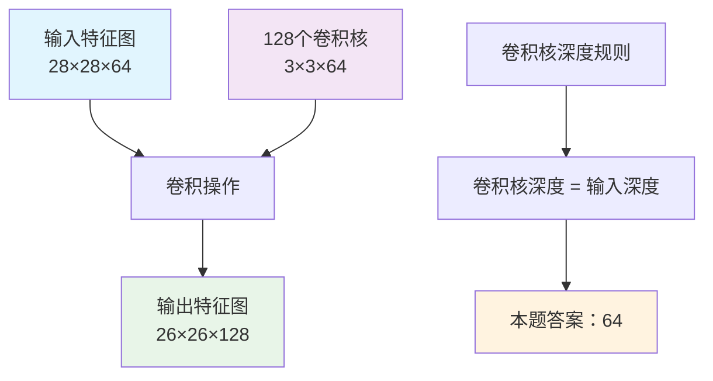

# HCIA-AI 题目分析 - 卷积核深度计算

## 题目内容

**问题**: 在卷积神经网络某个卷积层中，假设有128个3×3的卷积核，输入特征图尺寸为28×28×64，则卷积核的深度为()。（请填写阿拉伯数字）

**答案**: 64

## 解题思路

在卷积神经网络中，卷积核的深度必须与输入特征图的深度（通道数）保持一致，这是卷积操作的基本要求。

### 关键信息分析
- 输入特征图尺寸：28×28×64
  - 宽度：28
  - 高度：28
  - 深度（通道数）：64
- 卷积核数量：128个
- 卷积核尺寸：3×3

### 计算过程
卷积核深度 = 输入特征图深度 = 64

## 概念图解



## 知识点总结

### 核心概念

#### 1. 卷积核深度规则
- **必须匹配**：卷积核的深度必须等于输入特征图的深度
- **物理意义**：确保卷积操作能够处理所有输入通道
- **数学表示**：如果输入为 H×W×C，则卷积核为 K×K×C

#### 2. 卷积操作维度变化
- **输入**：28×28×64
- **卷积核**：3×3×64（128个）
- **输出**：26×26×128（假设无padding，stride=1）

#### 3. 参数计算
- **单个卷积核参数**：3×3×64 = 576个参数
- **总参数数量**：576×128 = 73,728个参数
- **加上偏置**：73,728 + 128 = 73,856个参数

### 卷积层设计原理

#### 输出尺寸计算公式
```
输出高度 = (输入高度 - 卷积核高度 + 2×padding) / stride + 1
输出宽度 = (输入宽度 - 卷积核宽度 + 2×padding) / stride + 1
输出深度 = 卷积核数量
```

#### 本题具体计算
- 输出高度 = (28 - 3 + 0) / 1 + 1 = 26
- 输出宽度 = (28 - 3 + 0) / 1 + 1 = 26
- 输出深度 = 128

### 常见误区

#### ❌ 错误理解
1. **混淆卷积核数量和深度**：认为深度是128
2. **忽略深度匹配规则**：随意设置卷积核深度
3. **混淆输入输出维度**：用输出深度作为卷积核深度

#### ✅ 正确理解
1. **卷积核深度 = 输入深度**：这是固定规则
2. **卷积核数量 = 输出深度**：决定输出特征图数量
3. **空间维度可变**：通过padding和stride调整

### 记忆要点

1. **深度匹配原则**："卷积核深度必须等于输入深度"
2. **维度变换规律**："输入深度→卷积核深度，卷积核数量→输出深度"
3. **参数计算**："卷积核尺寸×输入深度×卷积核数量"

## 扩展学习

### MindSpore中的实现

```python
import mindspore.nn as nn

# 定义卷积层
conv_layer = nn.Conv2d(
    in_channels=64,    # 输入深度，必须匹配
    out_channels=128,  # 输出深度，即卷积核数量
    kernel_size=3,     # 卷积核尺寸
    stride=1,
    padding=0
)

# 输入张量形状：(batch_size, 64, 28, 28)
# 输出张量形状：(batch_size, 128, 26, 26)
```

### 实际应用场景

#### 1. 特征提取
- **浅层**：提取边缘、纹理等低级特征
- **深层**：提取语义、对象等高级特征
- **深度增加**：从RGB(3)→64→128→256→512

#### 2. 网络设计
- **VGG**：逐层增加通道数
- **ResNet**：跳跃连接处理深度匹配
- **MobileNet**：深度可分离卷积优化

### 性能优化考虑

#### 1. 内存使用
- **特征图内存**：28×28×64×4字节 ≈ 200KB
- **参数内存**：73,856×4字节 ≈ 295KB
- **梯度内存**：与参数相同

#### 2. 计算复杂度
- **乘法运算**：26×26×128×3×3×64 ≈ 3.9亿次
- **加法运算**：类似数量级
- **优化方法**：im2col、Winograd算法

### 调试技巧

1. **维度检查**：打印每层输入输出形状
2. **参数统计**：验证参数数量计算
3. **梯度监控**：检查梯度流动情况
4. **可视化**：观察特征图变化