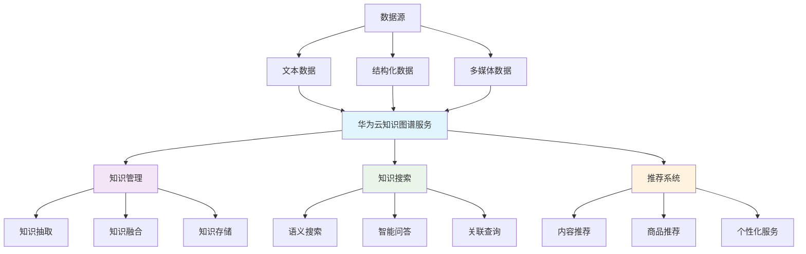

# HCIA-AI 题目分析 - 华为云知识图谱服务

## 题目内容

**问题**: 华为云()服务可以帮助企业进行知识管理、知识搜索、搭建推荐系统。（请填写中文）

**答案**: 知识图谱

## 解题思路

华为云知识图谱服务是华为云提供的智能知识管理平台，专门用于构建、管理和应用知识图谱。该服务能够帮助企业将分散的数据转化为结构化的知识，支持知识管理、智能搜索和个性化推荐等应用场景。

### 关键功能匹配
- **知识管理**：构建和维护企业知识库
- **知识搜索**：基于语义的智能搜索
- **推荐系统**：基于知识关联的个性化推荐

## 概念图解



## 知识点总结

### 核心概念

#### 1. 知识图谱基础
- **定义**：以图的形式表示实体及其关系的知识库
- **组成**：实体（Entity）、关系（Relation）、属性（Attribute）
- **表示**：三元组 <主体, 谓词, 客体>
- **特点**：语义丰富、结构化、可推理

#### 2. 华为云知识图谱服务架构

| 层次 | 功能 | 主要组件 | 说明 |
|------|------|----------|------|
| 应用层 | 业务应用 | 搜索、推荐、问答 | 面向最终用户的应用 |
| 服务层 | 知识服务 | 知识查询、推理、分析 | 提供知识相关的API服务 |
| 管理层 | 知识管理 | 构建、更新、维护 | 知识图谱的生命周期管理 |
| 存储层 | 数据存储 | 图数据库、索引 | 高效存储和检索知识 |

#### 3. 核心功能详解

**知识管理功能**：
- **知识抽取**：从非结构化文本中提取实体和关系
- **知识融合**：消除重复，统一表示
- **知识更新**：动态维护知识图谱的时效性
- **质量控制**：确保知识的准确性和一致性

**知识搜索功能**：
- **语义搜索**：理解用户查询意图
- **关联搜索**：基于实体关系扩展搜索结果
- **智能问答**：自然语言问题的精准回答
- **可视化展示**：图形化展示知识关系

**推荐系统功能**：
- **基于内容的推荐**：利用实体属性相似性
- **协同过滤推荐**：基于用户行为模式
- **混合推荐**：结合多种推荐策略
- **实时推荐**：动态调整推荐结果

### 技术实现

#### 1. 知识抽取技术
- **命名实体识别（NER）**：识别文本中的实体
- **关系抽取（RE）**：识别实体间的关系
- **事件抽取**：提取事件信息
- **属性抽取**：提取实体属性

#### 2. 知识表示学习
- **TransE**：将关系建模为平移操作
- **TransH**：处理一对多、多对一关系
- **RotatE**：将关系建模为旋转操作
- **ComplEx**：复数空间中的表示学习

#### 3. 图数据库技术
- **Neo4j**：流行的图数据库
- **ArangoDB**：多模型数据库
- **JanusGraph**：分布式图数据库
- **华为云GES**：图引擎服务

### 应用场景

#### 1. 企业知识管理
- **文档管理**：智能分类和标签
- **专家系统**：领域知识的结构化表示
- **培训系统**：个性化学习路径推荐
- **决策支持**：基于知识的智能决策

#### 2. 智能搜索
- **企业搜索**：内部文档和资料检索
- **电商搜索**：商品语义搜索
- **学术搜索**：科研文献智能检索
- **法律搜索**：法条和案例关联查询

#### 3. 推荐系统
- **新闻推荐**：基于用户兴趣和内容关联
- **商品推荐**：利用商品属性和用户偏好
- **社交推荐**：基于社交关系的推荐
- **学习推荐**：个性化课程和资源推荐

#### 4. 智能问答
- **客服机器人**：自动回答常见问题
- **医疗问答**：基于医学知识的诊断辅助
- **金融问答**：投资理财相关咨询
- **教育问答**：学习辅导和答疑

### 华为云知识图谱服务特色

#### 1. 技术优势
- **多模态融合**：支持文本、图像、视频等多种数据
- **自动化构建**：减少人工干预，提高效率
- **实时更新**：支持知识的动态更新
- **高性能查询**：优化的图查询引擎

#### 2. 产品特点
- **开箱即用**：提供预训练模型和工具
- **可视化界面**：直观的知识图谱管理界面
- **API接口**：丰富的开发接口
- **安全可靠**：企业级安全保障

#### 3. 生态集成
- **华为云AI服务**：与其他AI服务深度集成
- **大数据平台**：与华为云大数据服务协同
- **开发工具**：提供完整的开发工具链
- **行业解决方案**：针对不同行业的定制化方案

### 实施步骤

#### 1. 需求分析
- **业务场景梳理**：明确应用目标
- **数据源分析**：评估现有数据资源
- **技术架构设计**：规划系统架构
- **项目计划制定**：确定实施时间表

#### 2. 数据准备
- **数据收集**：整合各类数据源
- **数据清洗**：提高数据质量
- **数据标注**：为训练提供标准数据
- **数据安全**：确保数据隐私和安全

#### 3. 知识图谱构建
- **本体设计**：定义实体类型和关系
- **知识抽取**：从数据中提取知识
- **知识融合**：整合多源知识
- **质量评估**：验证知识图谱质量

#### 4. 应用开发
- **接口开发**：基于API开发应用
- **用户界面**：设计友好的交互界面
- **性能优化**：提升系统响应速度
- **测试部署**：确保系统稳定运行

### 记忆要点

1. **服务名称**："华为云知识图谱服务"
2. **核心功能**："知识管理、知识搜索、推荐系统"
3. **技术特点**："语义理解、关系推理、智能应用"
4. **应用价值**："提升企业知识管理效率和智能化水平"

## 扩展学习

### 华为云知识图谱API示例

```python
import requests
import json

class HuaweiKnowledgeGraph:
    """
    华为云知识图谱服务API调用示例
    """
    def __init__(self, endpoint, token):
        self.endpoint = endpoint
        self.headers = {
            'Authorization': f'Bearer {token}',
            'Content-Type': 'application/json'
        }
    
    def create_entity(self, entity_data):
        """
        创建实体
        """
        url = f"{self.endpoint}/entities"
        response = requests.post(url, 
                               headers=self.headers, 
                               data=json.dumps(entity_data))
        return response.json()
    
    def search_knowledge(self, query):
        """
        知识搜索
        """
        url = f"{self.endpoint}/search"
        params = {'q': query, 'limit': 10}
        response = requests.get(url, 
                              headers=self.headers, 
                              params=params)
        return response.json()
    
    def get_recommendations(self, user_id, item_type):
        """
        获取推荐结果
        """
        url = f"{self.endpoint}/recommendations"
        params = {
            'user_id': user_id,
            'item_type': item_type,
            'count': 5
        }
        response = requests.get(url, 
                              headers=self.headers, 
                              params=params)
        return response.json()

# 使用示例
kg_service = HuaweiKnowledgeGraph(
    endpoint='https://kg.huaweicloud.com/api/v1',
    token='your_access_token'
)

# 搜索知识
results = kg_service.search_knowledge('人工智能')
print(f'搜索结果: {results}')

# 获取推荐
recommendations = kg_service.get_recommendations(
    user_id='user123', 
    item_type='article'
)
print(f'推荐结果: {recommendations}')
```

### 知识图谱构建示例

```python
import networkx as nx
import matplotlib.pyplot as plt
from py2neo import Graph, Node, Relationship

class KnowledgeGraphBuilder:
    """
    知识图谱构建工具
    """
    def __init__(self):
        self.graph = nx.DiGraph()
        self.entities = {}
        self.relations = []
    
    def add_entity(self, entity_id, entity_type, properties):
        """
        添加实体
        """
        self.entities[entity_id] = {
            'type': entity_type,
            'properties': properties
        }
        self.graph.add_node(entity_id, **properties)
    
    def add_relation(self, subject, predicate, object_entity):
        """
        添加关系
        """
        self.relations.append({
            'subject': subject,
            'predicate': predicate,
            'object': object_entity
        })
        self.graph.add_edge(subject, object_entity, relation=predicate)
    
    def visualize(self):
        """
        可视化知识图谱
        """
        plt.figure(figsize=(12, 8))
        pos = nx.spring_layout(self.graph)
        nx.draw(self.graph, pos, with_labels=True, 
                node_color='lightblue', 
                node_size=1000,
                font_size=8,
                arrows=True)
        plt.title('知识图谱可视化')
        plt.show()
    
    def query_relations(self, entity):
        """
        查询实体关系
        """
        relations = []
        for rel in self.relations:
            if rel['subject'] == entity or rel['object'] == entity:
                relations.append(rel)
        return relations

# 构建示例知识图谱
kg_builder = KnowledgeGraphBuilder()

# 添加实体
kg_builder.add_entity('华为', '公司', {'成立时间': '1987', '总部': '深圳'})
kg_builder.add_entity('任正非', '人物', {'职位': 'CEO', '国籍': '中国'})
kg_builder.add_entity('AI', '技术', {'领域': '人工智能'})

# 添加关系
kg_builder.add_relation('任正非', '创立', '华为')
kg_builder.add_relation('华为', '研发', 'AI')

# 可视化
kg_builder.visualize()
```

### 推荐系统实现

```python
import numpy as np
from sklearn.metrics.pairwise import cosine_similarity

class KGRecommendationSystem:
    """
    基于知识图谱的推荐系统
    """
    def __init__(self, knowledge_graph):
        self.kg = knowledge_graph
        self.entity_embeddings = {}
        self.user_profiles = {}
    
    def compute_entity_similarity(self, entity1, entity2):
        """
        计算实体相似度
        """
        # 基于共同邻居的相似度
        neighbors1 = set(self.kg.neighbors(entity1))
        neighbors2 = set(self.kg.neighbors(entity2))
        
        intersection = len(neighbors1.intersection(neighbors2))
        union = len(neighbors1.union(neighbors2))
        
        return intersection / union if union > 0 else 0
    
    def build_user_profile(self, user_id, interaction_history):
        """
        构建用户画像
        """
        profile = {}
        for item in interaction_history:
            if item in self.kg.nodes:
                # 获取物品的属性和关联实体
                item_attrs = self.kg.nodes[item]
                for attr, value in item_attrs.items():
                    if attr not in profile:
                        profile[attr] = {}
                    if value not in profile[attr]:
                        profile[attr][value] = 0
                    profile[attr][value] += 1
        
        self.user_profiles[user_id] = profile
        return profile
    
    def recommend_items(self, user_id, candidate_items, top_k=5):
        """
        为用户推荐物品
        """
        if user_id not in self.user_profiles:
            return []
        
        user_profile = self.user_profiles[user_id]
        item_scores = []
        
        for item in candidate_items:
            score = self.calculate_item_score(item, user_profile)
            item_scores.append((item, score))
        
        # 按分数排序并返回top-k
        item_scores.sort(key=lambda x: x[1], reverse=True)
        return [item for item, score in item_scores[:top_k]]
    
    def calculate_item_score(self, item, user_profile):
        """
        计算物品对用户的推荐分数
        """
        if item not in self.kg.nodes:
            return 0
        
        item_attrs = self.kg.nodes[item]
        score = 0
        
        for attr, value in item_attrs.items():
            if attr in user_profile and value in user_profile[attr]:
                score += user_profile[attr][value]
        
        return score

# 使用示例
recommender = KGRecommendationSystem(kg_builder.graph)

# 构建用户画像
user_history = ['华为', 'AI']
profile = recommender.build_user_profile('user1', user_history)

# 推荐物品
candidates = ['任正非', '深度学习', '机器学习']
recommendations = recommender.recommend_items('user1', candidates)
print(f'推荐结果: {recommendations}')
```

### 性能优化策略

#### 1. 存储优化
- **图分片**：将大图分割为小片段
- **索引优化**：建立高效的查询索引
- **缓存策略**：缓存热点数据
- **压缩存储**：减少存储空间占用

#### 2. 查询优化
- **查询重写**：优化查询语句
- **并行处理**：利用多核并行计算
- **预计算**：预先计算常用结果
- **近似算法**：在精度和效率间平衡

#### 3. 更新优化
- **增量更新**：只更新变化的部分
- **批量处理**：批量执行更新操作
- **异步更新**：后台异步处理更新
- **版本控制**：管理知识图谱版本

### 质量评估指标

1. **完整性**：知识覆盖的完整程度
2. **准确性**：知识的正确性
3. **一致性**：知识间的逻辑一致性
4. **时效性**：知识的更新及时性
5. **可用性**：系统的可用性和稳定性