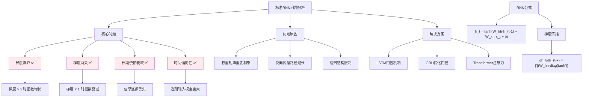

# HCIA-AI 题目分析 - 标准RNN描述

## 题目内容

**问题**: 以下关于标准RNN的描述正确的是哪几项？

**选项**:
- A. 标准的循环神经网络存在梯度爆炸和梯度消失问题。
- B. 标准RNN结构解决了信息记忆的问题但是对长时间记忆的信息会衰减
- C. 梯度消失梯度爆炸都与路径长度太长有关，前面的权重都基本固定不变，没有训练效果
- D. 标准RNN是一种死板的逻辑，越晚的输入影响越大越早的输入影响越小，且无法改变这个逻辑

## 选项分析表格

| 选项 | 内容 | 正确性 | 详细分析 | 知识点 |
|------|------|--------|----------|--------|
| A | 标准的循环神经网络存在梯度爆炸和梯度消失问题 | ✅ | 标准RNN在反向传播时，梯度会沿时间步传播，由于权重矩阵的重复相乘，容易导致梯度指数级增长(爆炸)或衰减(消失) | 梯度问题 |
| B | 标准RNN结构解决了信息记忆的问题但是对长时间记忆的信息会衰减 | ✅ | RNN通过隐藏状态实现了短期记忆能力，但由于梯度消失问题，长期依赖信息会逐渐衰减，无法有效保持长时间记忆 | 长期依赖 |
| C | 梯度消失梯度爆炸都与路径长度太长有关，前面的权重都基本固定不变，没有训练效果 | ✅ | 当序列很长时，早期时间步的梯度经过多次传播后变得极小，导致前面的权重几乎不更新，失去学习能力 | 梯度传播 |
| D | 标准RNN是一种死板的逻辑，越晚的输入影响越大越早的输入影响越小，且无法改变这个逻辑 | ✅ | 由于RNN的递归结构和梯度消失，近期输入对输出的影响确实比远期输入大，这是RNN固有的结构限制 | RNN局限性 |

## 正确答案
**答案**: ABCD

**解题思路**: 
1. 理解标准RNN的基本结构和工作原理
2. 分析RNN的主要问题：
   - 梯度爆炸/消失：由于权重矩阵重复相乘导致
   - 长期依赖问题：信息衰减，无法保持长时间记忆
   - 时间偏向性：近期输入影响更大
3. 认识到这些都是标准RNN的固有限制，促进了LSTM、GRU等改进模型的发展

## 概念图解

## 知识点总结

### 核心概念
- **梯度爆炸**: 梯度在反向传播过程中指数级增长，导致权重更新过大
- **梯度消失**: 梯度在长序列中逐渐衰减至接近零，权重无法有效更新
- **长期依赖**: RNN难以学习和记住长距离的时间依赖关系
- **时间偏向**: 由于结构特性，近期输入对输出的影响大于远期输入

### 相关技术
- **改进模型**: LSTM、GRU通过门控机制解决梯度问题
- **梯度裁剪**: 限制梯度范数来缓解梯度爆炸
- **权重初始化**: 合理的初始化策略减轻梯度问题
- **注意力机制**: Transformer通过自注意力解决长期依赖

### 记忆要点
- **四大问题**: 梯度爆炸 + 梯度消失 + 长期依赖衰减 + 时间偏向性
- **根本原因**: 权重矩阵重复相乘 + 反向传播路径过长
- **数学本质**: ∂h_t/∂h_{t-k} = ∏W_hh，连乘导致指数变化
- **解决思路**: 门控机制(LSTM/GRU) 或 注意力机制(Transformer)

## 扩展学习

### 相关文档
- [RNN梯度问题详解](https://arxiv.org/abs/1211.5063)
- [LSTM原理与实现](https://www.bioinf.jku.at/publications/older/2604.pdf)

### 实践应用
- **序列建模**: 语言模型、时间序列预测
- **问题诊断**: 通过梯度监控识别训练问题
- **模型选择**: 根据序列长度选择RNN变体
- **华为MindSpore**: `mindspore.nn.RNN()`提供标准RNN实现