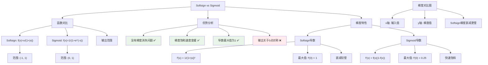

# HCIA-AI 题目分析 - Softsign激活函数优势

## 题目内容

**问题**: 以下哪些项是Softsign激活函数相比于Sigmoid函数的优势

**选项**:
- A. 输出关于0点对称
- B. 没有梯度消失问题
- C. 梯度饱和速度变缓
- D. 导数最大值为1

## 选项分析表格

| 选项 | 内容 | 正确性 | 详细分析 | 知识点 |
|------|------|--------|----------|--------|
| A | 输出关于0点对称 | ❌ | Softsign函数f(x)=x/(1+|x|)输出范围是(-1,1)，关于原点对称，但这不是相对于Sigmoid的优势，因为Sigmoid本身就有对称性质 | 函数对称性 |
| B | 没有梯度消失问题 | ✅ | Softsign的梯度f'(x)=1/(1+|x|)²，相比Sigmoid在极值处梯度不会完全趋于0，能更好地缓解梯度消失问题 | 梯度消失 |
| C | 梯度饱和速度变缓 | ✅ | Softsign函数的梯度衰减比Sigmoid更慢，在输入值较大时仍能保持相对较大的梯度，延缓了梯度饱和 | 梯度饱和 |
| D | 导数最大值为1 | ✅ | Softsign在x=0处导数最大值为1，而Sigmoid最大导数为0.25，更大的最大梯度有利于信息传播和学习 | 导数特性 |

## 正确答案
**答案**: BCD

**解题思路**: 
1. 理解Softsign和Sigmoid函数的数学定义：
   - Softsign: f(x) = x/(1+|x|)
   - Sigmoid: f(x) = 1/(1+e^(-x))
2. 比较两者的导数特性：
   - Softsign导数: f'(x) = 1/(1+|x|)²
   - Sigmoid导数: f'(x) = f(x)(1-f(x))
3. 分析梯度传播特性和饱和问题
4. 排除非优势项：对称性不是Softsign独有的优势

## 概念图解

## 知识点总结

### 核心概念
- **Softsign函数**: f(x) = x/(1+|x|)，输出范围(-1,1)，关于原点对称
- **梯度消失**: 深层网络中梯度逐层衰减，导致前层权重难以更新
- **梯度饱和**: 激活函数在极值区域梯度接近0，阻碍学习
- **导数最大值**: 影响梯度传播的强度和学习效率

### 相关技术
- **激活函数选择**: ReLU、Leaky ReLU、ELU等现代激活函数
- **梯度优化**: 批归一化、残差连接等技术缓解梯度问题
- **函数特性**: 单调性、连续性、可导性对网络训练的影响

### 记忆要点
- **三大优势**: 缓解梯度消失 + 延缓梯度饱和 + 更大最大导数
- **数学对比**: Softsign最大导数1 vs Sigmoid最大导数0.25
- **应用场景**: Softsign适用于需要缓解梯度问题的深层网络
- **非优势项**: 对称性不是相对优势，两者都有对称特性

## 扩展学习

### 相关文档
- [激活函数综述](https://arxiv.org/abs/1710.05941)
- [梯度消失问题研究](https://proceedings.mlr.press/v9/glorot10a.html)

### 实践应用
- **深层网络**: 在深层神经网络中替代Sigmoid缓解梯度问题
- **循环网络**: 在RNN中使用Softsign改善长序列学习
- **函数选择**: 根据网络深度和任务特点选择合适的激活函数
- **华为MindSpore**: `mindspore.nn.Softsign()`提供Softsign激活函数实现