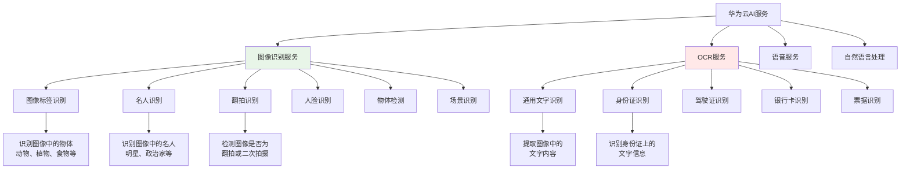

# HCIA-AI 题目分析 - 华为云OCR服务

## 题目内容

**问题**: 华为云（ ）服务提供图像标签识别、名人识别和翻拍识别等服务。

**答案框**: OCR

**正确答案**: 图像识别

## 选项分析表格

| 用户答案 | 正确答案 | 正确性 | 详细分析 | 知识点 |
|----------|----------|--------|----------|--------|
| OCR | 图像识别 | ❌ | 用户答案OCR是错误的。OCR（Optical Character Recognition，光学字符识别）主要用于识别图像中的文字内容，而题目中提到的"图像标签识别、名人识别和翻拍识别"属于图像识别服务的范畴，不是OCR的功能 | 华为云AI服务分类 |

## 正确答案
**答案**: 图像识别（Image Recognition）

**解题思路**: 
1. 分析题目中的关键服务类型：
   - 图像标签识别：识别图像中的物体、场景等
   - 名人识别：识别图像中的知名人物
   - 翻拍识别：检测图像是否为翻拍或截屏
2. 这些都属于图像内容理解和分析，不是文字识别
3. OCR专门用于文字识别，与题目描述的功能不符

## 概念图解

## 知识点总结

### 核心概念
- **图像识别**: 分析图像内容，识别其中的物体、人物、场景等视觉元素
- **OCR**: 专门识别和提取图像中的文字内容
- **计算机视觉**: 图像识别和OCR都属于计算机视觉领域的不同分支

### 华为云图像识别 vs OCR对比

| 服务类型 | 图像识别 | OCR |
|----------|----------|-----|
| 主要功能 | 识别图像内容 | 识别文字内容 |
| 应用场景 | 内容审核、智能相册、安防监控 | 文档数字化、票据录入、证件识别 |
| 输出结果 | 标签、类别、置信度 | 文字内容、位置坐标 |
| 技术基础 | 图像分类、目标检测 | 文字检测、文字识别 |

### 华为云图像识别服务功能
- **图像标签识别**: 自动为图像打标签，识别物体、场景、活动等
- **名人识别**: 识别图像中的知名人物，返回人物信息
- **翻拍识别**: 检测图像是否为翻拍、截屏或二次拍摄
- **人脸识别**: 检测和识别人脸特征
- **物体检测**: 定位和识别图像中的多个物体

### 华为云OCR服务功能
- **通用文字识别**: 识别自然场景中的文字
- **证件识别**: 身份证、驾驶证、护照等
- **票据识别**: 发票、收据、银行卡等
- **表格识别**: 结构化表格内容提取
- **手写文字识别**: 识别手写体文字

### 记忆要点
- **功能区分**: 图像识别看内容，OCR看文字
- **关键词识别**: "标签"、"名人"、"翻拍" → 图像识别
- **华为云服务**: 图像识别服务 ≠ OCR服务
- **应用场景**: 内容理解 vs 文字提取

## 扩展学习

### 相关API接口
- **图像标签**: POST /v2/{project_id}/image/tagging
- **名人识别**: POST /v1/{project_id}/image/celebrity-recognition
- **翻拍检测**: POST /v1/{project_id}/image/recapture-detect
- **通用OCR**: POST /v1/{project_id}/ocr/general-text

### 实践应用
- **智能相册**: 使用图像标签自动分类照片
- **内容审核**: 结合名人识别和内容标签进行审核
- **版权保护**: 使用翻拍识别检测盗版内容
- **文档数字化**: 使用OCR将纸质文档转为电子版

### 技术架构
- **深度学习模型**: 基于CNN、Transformer等架构
- **华为昇腾芯片**: 提供AI推理加速
- **ModelArts平台**: 模型训练和部署平台
- **API网关**: 提供标准化的REST API接口

### 计费模式
- **按调用次数计费**: 每次API调用收费
- **包年包月**: 固定费用，适合大量使用
- **免费额度**: 新用户有一定的免费调用次数
- **企业版**: 提供更高的并发和SLA保障