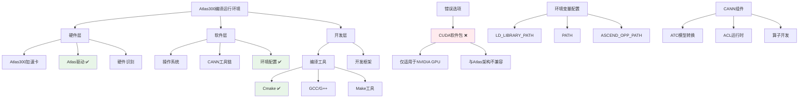

# HCIA-AI 题目分析 - Atlas300编译运行条件

## 题目内容

**问题**: 使用装有Atlas300(3000)加速卡的服务器编译运行程序时需要检查哪些条件？

**选项**:
- A. 完成Atlas驱动安装
- B. 已安装CUDA软件包
- C. 已安装Cmake编译工具
- D. 完成环境配置

## 选项分析表格

| 选项 | 内容 | 正确性 | 详细分析 | 知识点 |
|------|------|--------|----------|--------|
| A | 完成Atlas驱动安装 | ✅ | Atlas300是华为昇腾AI处理器，必须安装对应的Atlas驱动才能正常识别和使用硬件，这是基础前提条件 | Atlas驱动 |
| B | 已安装CUDA软件包 | ❌ | CUDA是NVIDIA GPU的开发平台，Atlas300使用的是华为昇腾处理器，不需要CUDA，而是需要CANN开发套件 | CUDA vs CANN |
| C | 已安装Cmake编译工具 | ✅ | Cmake是跨平台的编译工具，用于管理软件构建过程，编译Atlas相关程序时通常需要Cmake来处理复杂的编译配置 | 编译工具 |
| D | 完成环境配置 | ✅ | 包括设置环境变量、配置库路径、CANN工具链路径等，确保编译和运行环境正确配置 | 环境配置 |

## 正确答案
**答案**: ACD

**解题思路**: 
1. 理解Atlas300硬件特性：华为昇腾AI处理器，非NVIDIA GPU
2. 分析编译运行的必要条件：
   - 硬件驱动：Atlas驱动是硬件识别的基础
   - 编译工具：Cmake用于管理复杂的编译过程
   - 环境配置：确保运行时能找到相关库和工具
3. 排除错误选项：CUDA是NVIDIA专用，与Atlas无关

## 概念图解



## 知识点总结

### 核心概念
- **Atlas300**: 华为昇腾AI处理器，专为AI推理和训练设计的加速卡
- **Atlas驱动**: 硬件抽象层，提供操作系统与Atlas硬件的接口
- **CANN**: 华为异构计算架构，替代CUDA的开发平台
- **环境配置**: 包括库路径、工具链路径、环境变量等设置

### 相关技术
- **昇腾生态**: MindSpore、ModelArts与Atlas硬件的集成
- **编译工具链**: Cmake、GCC、Make等构建工具
- **运行时环境**: ACL(Ascend Computing Language)运行时库
- **模型转换**: ATC工具将模型转换为Atlas可执行格式

### 记忆要点
- **三要素**: Atlas驱动 + Cmake编译工具 + 环境配置
- **排除项**: CUDA是NVIDIA专用，Atlas使用CANN
- **华为生态**: Atlas硬件 + CANN软件 + MindSpore框架
- **环境变量**: LD_LIBRARY_PATH、ASCEND_OPP_PATH等关键配置

## 扩展学习

### 相关文档
- [Atlas300产品文档](https://support.huawei.com/enterprise/zh/ai-computing-platform/atlas-300-pid-250702915)
- [CANN开发指南](https://www.hiascend.com/document/detail/zh/CANNCommunityEdition/60RC1/devguide/)

### 实践应用
- **环境搭建**: 按顺序安装驱动→CANN→开发工具→配置环境
- **编译流程**: 
  ```bash
  mkdir build && cd build
  cmake .. -DCMAKE_CXX_COMPILER=g++
  make -j8
  ```
- **运行检查**: 使用`npu-smi info`检查Atlas设备状态
- **华为云集成**: 在ModelArts中直接使用Atlas推理服务