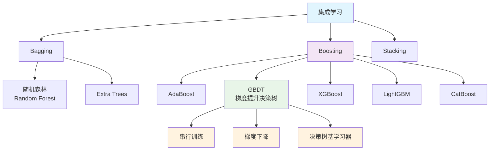

# HCIA-AI 题目分析 - GBDT算法类型

## 题目内容

**问题**: GBDT算法是集成学习中()算法的一种。

**答案**: Boosting

## 解题思路

GBDT（Gradient Boosting Decision Tree，梯度提升决策树）是集成学习中Boosting算法的典型代表。它通过串行训练多个弱学习器（决策树），每个新的学习器都专注于修正前面学习器的错误，最终组合成强学习器。

### 关键概念
- **GBDT**：梯度提升决策树
- **集成学习**：组合多个学习器的方法
- **Boosting**：串行训练，后续学习器修正前面的错误
- **弱学习器**：通常使用决策树（特别是CART树）

## 概念图解



## 知识点总结

### 核心概念

#### 1. GBDT基本原理
- **全称**：Gradient Boosting Decision Tree
- **核心思想**：通过梯度下降优化损失函数
- **训练方式**：串行训练多个决策树
- **预测方式**：所有树的预测结果相加

#### 2. Boosting算法特点
- **串行训练**：每个学习器依次训练
- **错误修正**：后续学习器专注于前面学习器的错误
- **权重调整**：根据错误程度调整样本权重
- **最终预测**：加权组合所有学习器的结果

#### 3. 与其他集成方法对比

| 方法 | 训练方式 | 基学习器关系 | 典型算法 | 主要优势 |
|------|----------|--------------|----------|----------|
| Bagging | 并行 | 独立训练 | 随机森林 | 降低方差，防止过拟合 |
| Boosting | 串行 | 依赖前面结果 | GBDT, AdaBoost | 降低偏差，提高准确性 |
| Stacking | 分层 | 元学习器组合 | Stacked Generalization | 充分利用不同算法优势 |

### GBDT算法详解

#### 1. 数学原理

**目标函数**：
```
L(y, F(x)) + Ω(F)
```
其中：
- L(y, F(x))：损失函数
- Ω(F)：正则化项
- F(x)：模型预测值

**梯度计算**：
```
g_i = ∂L(y_i, F(x_i))/∂F(x_i)
```

**模型更新**：
```
F_m(x) = F_{m-1}(x) + γ_m * h_m(x)
```

#### 2. 算法流程
1. **初始化**：F_0(x) = argmin_γ Σ L(y_i, γ)
2. **迭代训练**：
   - 计算负梯度（伪残差）
   - 训练新的决策树拟合负梯度
   - 计算最优步长
   - 更新模型
3. **输出**：最终模型 F_M(x)

#### 3. 关键参数
- **n_estimators**：树的数量
- **learning_rate**：学习率（步长）
- **max_depth**：树的最大深度
- **min_samples_split**：内部节点分割所需最小样本数
- **subsample**：子采样比例

### GBDT家族算法

#### 1. XGBoost（eXtreme Gradient Boosting）
- **优化**：二阶梯度信息、正则化
- **特点**：高效、可扩展、支持并行
- **应用**：Kaggle竞赛热门算法

#### 2. LightGBM（Light Gradient Boosting Machine）
- **优化**：基于直方图的算法、叶子生长策略
- **特点**：训练速度快、内存占用少
- **应用**：大规模数据处理

#### 3. CatBoost（Categorical Boosting）
- **优化**：处理类别特征、对称树结构
- **特点**：无需特征预处理、防止过拟合
- **应用**：包含大量类别特征的数据

### 优缺点分析

#### ✅ 优点
1. **预测精度高**：通过串行优化不断提升性能
2. **特征选择能力强**：自动进行特征选择
3. **处理非线性关系**：决策树能捕捉复杂模式
4. **鲁棒性好**：对异常值相对不敏感
5. **无需特征缩放**：树模型不受特征尺度影响

#### ❌ 缺点
1. **训练时间长**：串行训练无法并行
2. **容易过拟合**：需要仔细调参
3. **对噪声敏感**：可能学习到噪声模式
4. **参数较多**：需要经验调参
5. **可解释性差**：模型复杂度高

### 实际应用场景

#### 1. 推荐系统
- **CTR预测**：点击率预测
- **排序算法**：搜索结果排序
- **用户画像**：用户特征建模

#### 2. 金融风控
- **信用评分**：贷款违约预测
- **欺诈检测**：异常交易识别
- **风险定价**：保险费率计算

#### 3. 医疗诊断
- **疾病预测**：基于症状和检查结果
- **药物效果**：个性化治疗方案
- **影像分析**：医学图像辅助诊断

### 记忆要点

1. **算法归属**："GBDT属于Boosting算法家族"
2. **核心特点**："串行训练，梯度优化，决策树基学习器"
3. **主要优势**："高精度，强特征选择能力"
4. **典型应用**："推荐系统，金融风控，竞赛建模"

## 扩展学习

### Python实现示例

```python
from sklearn.ensemble import GradientBoostingClassifier, GradientBoostingRegressor
from sklearn.model_selection import train_test_split
from sklearn.metrics import accuracy_score, mean_squared_error
import numpy as np

# 分类任务
clf = GradientBoostingClassifier(
    n_estimators=100,
    learning_rate=0.1,
    max_depth=3,
    random_state=42
)

# 回归任务
reg = GradientBoostingRegressor(
    n_estimators=100,
    learning_rate=0.1,
    max_depth=3,
    random_state=42
)

# 训练和预测
X_train, X_test, y_train, y_test = train_test_split(X, y, test_size=0.2)
clf.fit(X_train, y_train)
y_pred = clf.predict(X_test)
accuracy = accuracy_score(y_test, y_pred)
```

### XGBoost实现

```python
import xgboost as xgb
from sklearn.model_selection import cross_val_score

# XGBoost分类器
xgb_clf = xgb.XGBClassifier(
    n_estimators=100,
    learning_rate=0.1,
    max_depth=3,
    subsample=0.8,
    colsample_bytree=0.8,
    random_state=42
)

# 交叉验证
scores = cross_val_score(xgb_clf, X, y, cv=5, scoring='accuracy')
print(f'平均准确率: {scores.mean():.4f}')
```

### MindSpore中的实现思路

```python
import mindspore as ms
import mindspore.nn as nn
from mindspore import ops

class SimpleGBDT(nn.Cell):
    """
    简化的GBDT实现思路
    """
    def __init__(self, n_estimators=100, learning_rate=0.1):
        super(SimpleGBDT, self).__init__()
        self.n_estimators = n_estimators
        self.learning_rate = learning_rate
        self.trees = []
        
    def construct(self, x):
        # 初始预测
        prediction = ops.zeros_like(x[:, 0])
        
        # 累加所有树的预测
        for tree in self.trees:
            prediction += self.learning_rate * tree(x)
            
        return prediction
    
    def fit(self, X, y):
        # 初始化
        F = ops.zeros_like(y)
        
        for m in range(self.n_estimators):
            # 计算负梯度（伪残差）
            residuals = y - F
            
            # 训练新树拟合残差
            tree = self._fit_tree(X, residuals)
            self.trees.append(tree)
            
            # 更新预测
            F += self.learning_rate * tree(X)
```

### 参数调优指南

#### 1. 基础参数
- **n_estimators**：从100开始，根据验证集表现调整
- **learning_rate**：通常0.01-0.3，与n_estimators成反比
- **max_depth**：3-8，防止过拟合

#### 2. 正则化参数
- **subsample**：0.8-1.0，子采样比例
- **min_samples_split**：根据数据集大小调整
- **min_samples_leaf**：叶节点最小样本数

#### 3. 调参策略
1. **粗调**：大范围搜索主要参数
2. **细调**：在最优区域精细搜索
3. **交叉验证**：避免过拟合
4. **早停机制**：监控验证集性能

### 性能优化技巧

1. **特征工程**：
   - 特征选择和构造
   - 处理缺失值
   - 类别特征编码

2. **模型优化**：
   - 使用验证集早停
   - 调整学习率和树数量
   - 使用正则化防止过拟合

3. **计算优化**：
   - 并行特征选择
   - 近似分割算法
   - 内存优化技术

### 模型解释性

1. **特征重要性**：基于分割次数和信息增益
2. **SHAP值**：解释单个预测的贡献
3. **部分依赖图**：特征与预测的关系
4. **树结构可视化**：理解决策路径