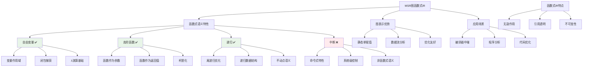

# HCIA-AI 题目分析 - MSR图函数式IR语义类型

## 题目内容

**问题**: MSR是一种简洁高效灵活的基于图的图函数式IR，可以表示的图函数式语义类型有？

**选项**:
- A. 自由变量
- B. 高阶函数
- C. 中断
- D. 递归

## 选项分析表格

| 选项 | 内容 | 正确性 | 详细分析 | 知识点 |
|------|------|--------|----------|--------|
| A | 自由变量 | ✅ | MSR IR支持自由变量的表示，自由变量是函数式编程中的基本概念，指在当前作用域中未绑定但在外层作用域中定义的变量 | 自由变量 |
| B | 高阶函数 | ✅ | MSR作为函数式IR，天然支持高阶函数，即函数可以作为参数传递或作为返回值，这是函数式编程的核心特性 | 高阶函数 |
| C | 中断 | ❌ | 中断是系统级的控制流概念，属于命令式编程范畴，不是函数式语义的典型特性，MSR主要关注函数式语义表示 | 控制流 |
| D | 递归 | ✅ | 递归是函数式编程的重要特性，MSR IR能够表示递归函数调用和递归数据结构，这是函数式语义的基本要求 | 递归调用 |

## 正确答案
**答案**: ABD

**解题思路**: 
1. 理解MSR IR的定位：基于图的函数式中间表示
2. 分析函数式编程的核心语义特性：
   - 自由变量：作用域和变量绑定
   - 高阶函数：函数作为一等公民
   - 递归：函数式编程的基本控制结构
3. 排除非函数式特性：中断属于命令式控制流，不是函数式语义

## 概念图解

## 知识点总结

### 核心概念
- **MSR IR**: 基于图的函数式中间表示，用于编译器优化和程序分析
- **自由变量**: 在当前函数作用域外定义但在函数内使用的变量
- **高阶函数**: 接受函数作为参数或返回函数的函数
- **递归**: 函数直接或间接调用自身的编程技术

### 相关技术
- **λ演算**: 函数式编程的理论基础
- **静态单赋值(SSA)**: 编译器中间表示的常用形式
- **数据流分析**: 基于图结构的程序分析技术
- **函数式优化**: 尾递归消除、内联展开等

### 记忆要点
- **三大函数式特性**: 自由变量 + 高阶函数 + 递归
- **排除命令式**: 中断属于系统级控制，非函数式语义
- **图IR优势**: 便于数据流分析和优化变换
- **应用领域**: 编译器中端、程序分析、代码优化

## 扩展学习

### 相关文档
- [函数式编程理论](https://en.wikipedia.org/wiki/Functional_programming)
- [编译器中间表示设计](https://llvm.org/docs/LangRef.html)

### 实践应用
- **编译器设计**: 函数式语言的中间表示设计
- **程序分析**: 基于图的静态分析技术
- **代码优化**: 函数内联、尾递归优化等
- **华为编译器**: 在华为编译器工具链中的IR设计应用