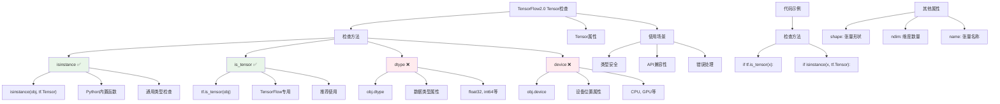

# HCIA-AI 题目分析 - TensorFlow2.0检查tensor方法

## 题目内容

**问题**: TensorFlow2.0中可以用来查看是否是tensor的方法有？

**选项**:
- A. dtype
- B. isinstance
- C. is_tensor
- D. device

## 选项分析表格

| 选项 | 内容 | 正确性 | 详细分析 | 知识点 |
|------|------|--------|----------|--------|
| A | dtype | ❌ | dtype是tensor的属性，用于查看tensor的数据类型(如float32、int64等)，不是用来判断对象是否为tensor的方法 | tensor属性 |
| B | isinstance | ✅ | isinstance(obj, tf.Tensor)是Python内置函数，可以检查对象是否为tf.Tensor类型的实例，是标准的类型检查方法 | 类型检查 |
| C | is_tensor | ✅ | tf.is_tensor()是TensorFlow提供的专用函数，用于检查对象是否为tensor，返回布尔值，是推荐的检查方法 | TF专用函数 |
| D | device | ❌ | device是tensor的属性，用于查看tensor所在的设备(CPU/GPU)，不是用来判断对象是否为tensor的方法 | 设备信息 |

## 正确答案
**答案**: BC

**解题思路**: 
1. 理解问题要求：查找判断对象是否为tensor的方法
2. 区分tensor的属性和检查方法：
   - 属性：dtype、device、shape等用于获取tensor信息
   - 检查方法：isinstance、is_tensor用于类型判断
3. 分析TensorFlow2.0的API设计和Python类型检查机制

## 概念图解



## 知识点总结

### 核心概念
- **tf.is_tensor()**: TensorFlow专用的tensor类型检查函数
- **isinstance()**: Python内置的类型检查函数，可用于检查tf.Tensor类型
- **dtype**: tensor的数据类型属性，不是检查方法
- **device**: tensor的设备位置属性，不是检查方法

### 相关技术
- **类型检查**: 在动态类型语言中确保类型安全的重要手段
- **TensorFlow API**: 提供丰富的tensor操作和检查函数
- **Python反射**: isinstance、type等内置函数的使用
- **错误处理**: 在tensor操作前进行类型检查避免运行时错误

### 记忆要点
- **两种检查方法**: tf.is_tensor() + isinstance()
- **属性vs方法**: dtype/device是属性，不是检查方法
- **推荐使用**: tf.is_tensor()更符合TensorFlow编程习惯
- **代码示例**: 
  ```python
  # 方法1：TensorFlow专用
  if tf.is_tensor(x):
      print("x is a tensor")
  
  # 方法2：Python通用
  if isinstance(x, tf.Tensor):
      print("x is a tensor")
  ```

## 扩展学习

### 相关文档
- [TensorFlow API文档](https://www.tensorflow.org/api_docs/python/tf/is_tensor)
- [Python isinstance文档](https://docs.python.org/3/library/functions.html#isinstance)

### 实践应用
- **函数参数检查**: 在函数开始时检查输入是否为tensor
- **类型安全编程**: 避免在非tensor对象上调用tensor方法
- **调试和测试**: 在单元测试中验证函数返回值类型
- **华为MindSpore对比**: MindSpore中使用`isinstance(x, mindspore.Tensor)`进行类似检查