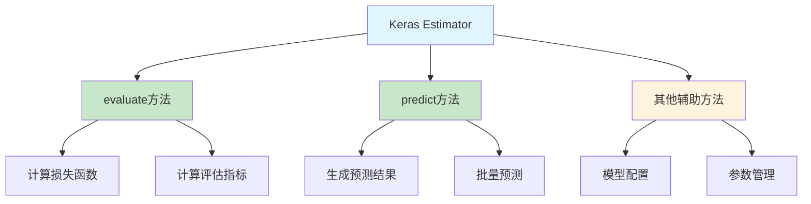

# HCIA-AI 题目分析 - keras Estimator封装方法

## 题目内容

**问题**: 下列选项中属于keras Estimator封装的方法有?

**选项**:
- A. 评估
- B. 训练
- C. 预测
- D. 输出模型

## 选项分析表格

| 选项 | 内容 | 正确性 | 详细分析 | 知识点 |
|------|------|--------|----------|--------|
| A | 评估 | ✅ | Estimator提供evaluate()方法用于模型评估，可以计算损失函数和各种指标 | 模型评估 |
| B | 训练 | ❌ | Estimator本身不直接提供训练方法，训练是通过fit()方法在Model中实现的 | 模型训练 |
| C | 预测 | ✅ | Estimator提供predict()方法用于模型预测，输出预测结果 | 模型预测 |
| D | 输出模型 | ❌ | 输出模型不是Estimator的核心封装方法，而是模型保存功能 | 模型保存 |

## 正确答案
**答案**: AC

**解题思路**: 
1. Keras Estimator是TensorFlow中的高级API，主要封装了模型的核心操作
2. 评估(evaluate)和预测(predict)是Estimator的核心方法
3. 训练通常通过Model的fit()方法实现，不是Estimator的直接封装
4. 输出模型属于模型保存功能，不是Estimator的核心方法

## 概念图解

## 知识点总结

### 核心概念
- **Estimator**: TensorFlow的高级API，提供统一的模型接口
- **evaluate()**: 模型评估方法，计算测试集上的性能指标
- **predict()**: 模型预测方法，对新数据进行推理

### 相关技术
- **TensorFlow Estimator API**: 高级模型抽象接口
- **Keras集成**: 与Keras模型的无缝集成
- **分布式训练**: 支持多GPU和分布式计算

### 记忆要点
- Estimator主要封装"评估"和"预测"两大核心功能
- 训练功能通常在Model层面实现，不是Estimator的直接方法
- 区分Estimator方法与Model方法的职责分工

## 扩展学习

### 相关文档
- TensorFlow Estimator官方文档
- Keras与Estimator集成指南
- 模型评估最佳实践

### 实践应用
- 模型性能评估流程
- 生产环境模型部署
- 批量预测服务实现