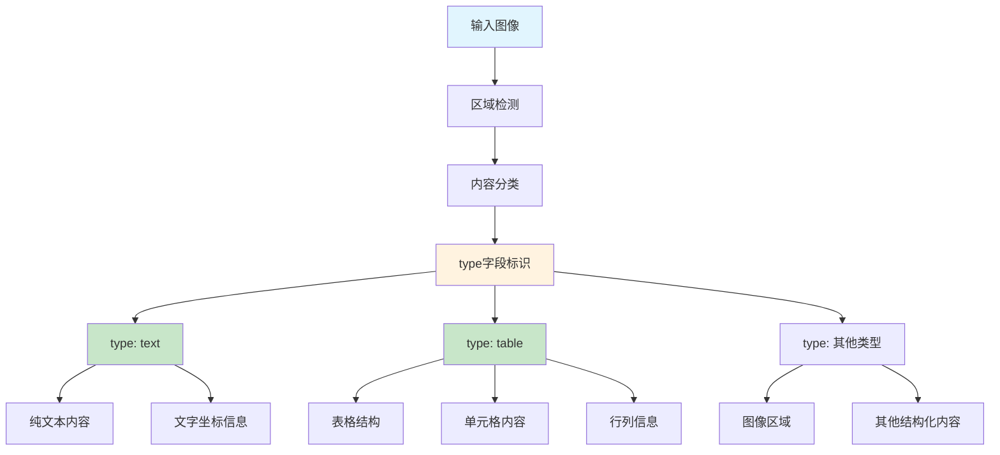

# HCIA-AI 题目分析 - 通用表格识别服务type字段

## 题目内容

**问题**: 下列关于通用表格识别服务返回的type字段说法正确的是?

**选项**:
- A. type代表文字识别区域类型
- B. type为text时代表文本识别区域
- C. type代表表格类型
- D. type为table时代表表格识别区域

## 选项分析表格

| 选项 | 内容 | 正确性 | 详细分析 | 知识点 |
|------|------|--------|----------|--------|
| A | type代表文字识别区域类型 | ❌ | type字段不是用来标识文字识别区域类型，而是标识内容区域的具体类型 | OCR区域分类 |
| B | type为text时代表文本识别区域 | ✅ | 正确，当type="text"时，表示该区域识别出的是纯文本内容 | 文本区域识别 |
| C | type代表表格类型 | ❌ | type不是表示表格的类型分类，而是标识识别区域的内容类型 | 表格分类 |
| D | type为table时代表表格识别区域 | ✅ | 正确，当type="table"时，表示该区域识别出的是表格结构内容 | 表格区域识别 |

## 正确答案
**答案**: BD

**解题思路**: 
1. 通用表格识别服务会对输入图像进行区域分割和内容识别
2. type字段用于标识每个识别区域的内容类型
3. type="text"表示纯文本区域，type="table"表示表格区域
4. 这种分类有助于后续的内容处理和结构化提取

## 概念图解

## 知识点总结

### 核心概念
- **type字段**: 标识识别区域的内容类型
- **text类型**: 表示纯文本识别区域
- **table类型**: 表示表格结构识别区域

### 相关技术
- **华为云OCR服务**: 通用表格识别API
- **区域检测算法**: 自动识别图像中的不同内容区域
- **内容分类技术**: 区分文本、表格等不同类型内容

### 记忆要点
- type字段是"内容类型"标识，不是"区域类型"或"表格类型"
- text和table是最常见的两种type值
- 理解OCR服务的分层处理：检测→分类→识别

## 扩展学习

### 相关文档
- 华为云OCR服务API文档
- 通用表格识别服务使用指南
- OCR结果数据结构说明

### 实践应用
- 文档数字化处理
- 表格数据自动提取
- 混合内容智能识别