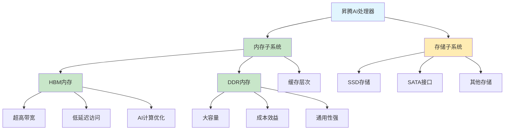

# HCIA-AI 题目分析 - 昇腾AI处理器内存类型

## 题目内容

**问题**: 昇腾AI处理器支持接入以下哪些种类的内存?

**选项**:
- A. SATA
- B. SSD
- C. HBM
- D. DDR

## 选项分析表格

| 选项 | 内容 | 正确性 | 详细分析 | 知识点 |
|------|------|--------|----------|--------|
| A | SATA | ❌ | SATA是存储接口标准，不是内存类型，用于连接硬盘等存储设备 | 存储接口 |
| B | SSD | ❌ | SSD是固态硬盘，属于存储设备而非内存，虽然速度快但不是处理器直接访问的内存 | 存储设备 |
| C | HBM | ✅ | HBM(High Bandwidth Memory)是高带宽内存，昇腾AI处理器支持HBM内存以提供高速数据访问 | 高带宽内存 |
| D | DDR | ✅ | DDR(Double Data Rate)是双倍数据速率内存，昇腾AI处理器支持DDR内存作为主要系统内存 | 系统内存 |

## 正确答案
**答案**: CD

**解题思路**: 
1. 区分内存(Memory)和存储(Storage)的概念
2. 内存是处理器直接访问的高速存储介质
3. HBM和DDR都是内存技术，而SATA和SSD属于存储范畴
4. 昇腾AI处理器需要高带宽内存支持AI计算的大数据量需求

## 概念图解

## 知识点总结

### 核心概念
- **HBM内存**: 高带宽内存，专为高性能计算设计
- **DDR内存**: 双倍数据速率内存，主流系统内存技术
- **内存vs存储**: 内存直接被处理器访问，存储用于数据持久化

### 相关技术
- **昇腾AI处理器架构**: 华为自研AI芯片
- **内存层次结构**: 缓存-内存-存储的层次化设计
- **AI计算内存需求**: 大数据量、高带宽的内存访问模式

### 记忆要点
- 内存(Memory)≠存储(Storage)，要明确区分概念
- HBM专为AI/HPC设计，DDR是通用内存标准
- SATA是接口，SSD是存储设备，都不属于内存范畴

## 扩展学习

### 相关文档
- 昇腾AI处理器技术白皮书
- HBM内存技术规范
- AI芯片内存架构设计

### 实践应用
- AI训练任务的内存配置
- 高性能计算内存优化
- 昇腾平台部署最佳实践