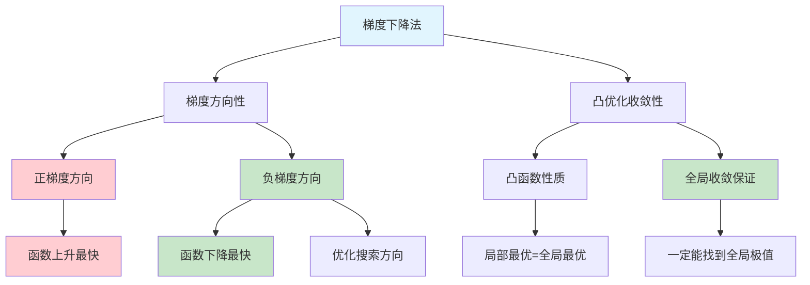

# HCIA-AI 题目分析 - 梯度下降法描述错误

## 题目内容

**问题**: 以下关于梯度下降法的描述错误的是哪些项?

**选项**:
- A. 负梯度方向是函数下降最快的方向
- B. 梯度下降法一定够在凸优化问题中取得全局极值点
- C. 梯度下降法不一定能够在凸优化问题中取得全局极值点
- D. 负梯度方向是函数上升最快的方向

## 选项分析表格

| 选项 | 内容 | 正确性 | 详细分析 | 知识点 |
|------|------|--------|----------|--------|
| A | 负梯度方向是函数下降最快的方向 | ✅ | 正确描述。梯度指向函数增长最快的方向，负梯度方向就是函数下降最快的方向 | 梯度定义 |
| B | 梯度下降法一定够在凸优化问题中取得全局极值点 | ✅ | 正确描述。在凸函数中，局部最优解就是全局最优解，梯度下降法能收敛到全局最优 | 凸优化理论 |
| C | 梯度下降法不一定能够在凸优化问题中取得全局极值点 | ❌ | 错误描述。这与选项B矛盾，在凸优化问题中梯度下降法是能够取得全局极值点的 | 凸优化收敛性 |
| D | 负梯度方向是函数上升最快的方向 | ❌ | 错误描述。负梯度方向是下降最快的方向，正梯度方向才是上升最快的方向 | 梯度方向 |

## 正确答案
**答案**: CD

**解题思路**: 
1. 理解梯度的几何意义：梯度指向函数增长最快的方向
2. 负梯度方向是函数下降最快的方向，这是梯度下降法的理论基础
3. 在凸优化问题中，梯度下降法具有全局收敛性保证
4. 选项C和D都是错误的描述，因此是答案

## 概念图解

## 知识点总结

### 核心概念
- **梯度方向**: 函数在某点增长最快的方向
- **负梯度方向**: 函数在某点下降最快的方向
- **凸优化**: 在凸函数上的优化问题，具有全局收敛性

### 相关技术
- **梯度下降算法**: 基于负梯度方向的迭代优化方法
- **凸函数理论**: 保证优化算法全局收敛的数学基础
- **优化收敛性**: 算法能够找到最优解的理论保证

### 记忆要点
- 梯度=上升方向，负梯度=下降方向
- 凸优化问题中梯度下降法"一定"能找到全局最优
- 区分凸优化和非凸优化的收敛性差异

## 扩展学习

### 相关文档
- 凸优化理论基础
- 梯度下降算法变种
- 非凸优化中的局部最优问题

### 实践应用
- 深度学习中的梯度下降
- 机器学习模型优化
- 数值优化算法设计