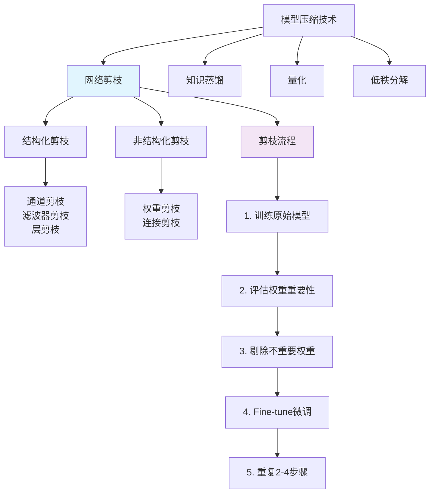

# HCIA-AI 题目分析 - 网络剪枝技术

## 题目内容

**问题**: （ ）的主要思想就是将权重矩阵中相对"不重要"的权值剔除，然后再重新finetune网络进行微调

**答案框**: Dropout

**正确答案**: 网络剪枝

## 选项分析表格

| 用户答案 | 正确答案 | 正确性 | 详细分析 | 知识点 |
|----------|----------|--------|----------|--------|
| Dropout | 网络剪枝 | ❌ | 用户答案Dropout是错误的。Dropout是一种正则化技术，在训练过程中随机将部分神经元输出设为0，防止过拟合，但不会永久剔除权重。而网络剪枝（Network Pruning）才是将不重要的权重永久移除，然后重新训练的技术 | 模型压缩与优化 |

## 正确答案
**答案**: 网络剪枝（Network Pruning）

**解题思路**: 
1. 关键词分析："权重矩阵"、"不重要的权值剔除"、"finetune微调"
2. Dropout vs 网络剪枝的区别：
   - Dropout：训练时随机置零，测试时恢复，是临时性的
   - 网络剪枝：永久移除不重要权重，是结构性的改变
3. "剔除后重新finetune"明确指向网络剪枝的典型流程

## 概念图解

## 知识点总结

### 核心概念
- **网络剪枝**: 通过移除神经网络中不重要的权重或连接来减少模型大小和计算量的技术
- **权重重要性评估**: 使用梯度、激活值、权重大小等指标评估权重的重要程度
- **Fine-tuning**: 剪枝后重新训练网络以恢复性能的过程

### Dropout vs 网络剪枝对比

| 特征 | Dropout | 网络剪枝 |
|------|---------|----------|
| 作用时机 | 仅训练时 | 训练后永久生效 |
| 目的 | 防止过拟合 | 模型压缩 |
| 权重处理 | 临时置零 | 永久移除 |
| 模型结构 | 不改变 | 改变网络结构 |
| 推理速度 | 无提升 | 显著提升 |

### 剪枝技术分类
- **结构化剪枝**: 移除整个通道、滤波器或层
- **非结构化剪枝**: 移除单个权重连接
- **动态剪枝**: 训练过程中逐步剪枝
- **静态剪枝**: 训练完成后一次性剪枝

### 记忆要点
- **关键词识别**: "剔除权重" + "finetune" = 网络剪枝
- **Dropout特点**: 随机、临时、正则化
- **剪枝特点**: 永久、结构化、压缩
- **剪枝流程**: 训练→评估→剔除→微调→重复

## 扩展学习

### 相关技术
- **华为MindSpore**: 提供自动剪枝算法和工具
- **TensorFlow Model Optimization**: 包含剪枝API
- **PyTorch**: torch.nn.utils.prune模块
- **NVIDIA TensorRT**: 支持剪枝模型的推理优化

### 实践应用
- **移动端部署**: 通过剪枝减少模型大小，适合移动设备
- **边缘计算**: 降低计算复杂度，提高推理速度
- **云端服务**: 减少服务器资源消耗，提高并发能力
- **华为昇腾**: 支持剪枝模型的高效推理

### 性能指标
- **压缩比**: 剪枝后模型大小与原模型的比值
- **加速比**: 推理速度提升倍数
- **精度损失**: 剪枝后准确率下降程度
- **FLOPS减少**: 浮点运算次数的降低比例