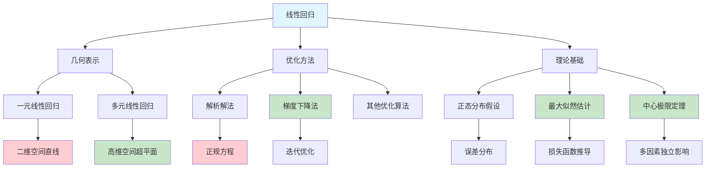

# HCIA-AI 题目分析 - 线性回归描述错误

## 题目内容

**问题**: 以下关于线性回归的描述中，哪些选项是错误的?

**选项**:
- A. 多元线性回归分析出来的一定是高维空间中的一条直线
- B. 由于算法复杂度，线性回归无法使用梯度下降的方法求出当损失函数达到最小时候的权重参数
- C. 根据正态分布函数与最大似然估计，可以求出线性回归的损失函数
- D. 线性回归中误差受到众多因素独立影响，根据中心极限定律误差服从正态分布

## 选项分析表格

| 选项 | 内容 | 正确性 | 详细分析 | 知识点 |
|------|------|--------|----------|--------|
| A | 多元线性回归分析出来的一定是高维空间中的一条直线 | ❌ | 错误。多元线性回归在高维空间中表示的是超平面(hyperplane)，不是直线。只有一元线性回归才是直线 | 几何表示 |
| B | 由于算法复杂度，线性回归无法使用梯度下降的方法求出当损失函数达到最小时候的权重参数 | ❌ | 错误。线性回归完全可以使用梯度下降法求解，这是常用的优化方法之一，算法复杂度并不高 | 优化算法 |
| C | 根据正态分布函数与最大似然估计，可以求出线性回归的损失函数 | ✅ | 正确。假设误差服从正态分布，通过最大似然估计可以推导出最小二乘损失函数 | 理论推导 |
| D | 线性回归中误差受到众多因素独立影响，根据中心极限定律误差服从正态分布 | ✅ | 正确。这是线性回归模型的基本假设，多个独立随机因素的叠加趋向于正态分布 | 统计假设 |

## 正确答案
**答案**: AB

**解题思路**: 
1. 理解线性回归的几何表示：一元是直线，多元是超平面
2. 线性回归的优化方法：既可以解析求解，也可以用梯度下降
3. 线性回归的理论基础：正态分布假设和最大似然估计
4. 选项A和B都是错误的描述

## 概念图解

## 知识点总结

### 核心概念
- **超平面vs直线**: 多元线性回归在高维空间表示超平面
- **梯度下降适用性**: 线性回归完全可以使用梯度下降优化
- **理论基础**: 正态分布假设和最大似然估计

### 相关技术
- **线性回归几何**: 从直线到超平面的维度扩展
- **优化算法**: 解析解vs数值解的选择
- **统计理论**: 正态分布、最大似然估计、中心极限定理

### 记忆要点
- 多元线性回归=高维超平面，不是直线
- 线性回归可以用梯度下降，算法复杂度不高
- 正态分布假设是线性回归的重要理论基础

## 扩展学习

### 相关文档
- 线性回归数学推导
- 最大似然估计理论
- 梯度下降算法实现

### 实践应用
- 回归分析建模
- 特征工程与线性回归
- 正则化线性回归(Ridge/Lasso)