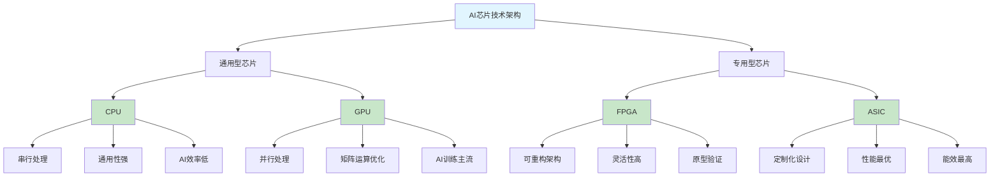

# HCIA-AI 题目分析 - AI芯片技术架构分类

## 题目内容

**问题**: 从技术架构来看AI芯片的分类包括?

**选项**:
- A. FPGA
- B. CPU
- C. GPU
- D. ASIC

## 选项分析表格

| 选项 | 内容 | 正确性 | 详细分析 | 知识点 |
|------|------|--------|----------|--------|
| A | FPGA | ✅ | 现场可编程门阵列，可重构硬件架构，适合AI算法原型验证和特定应用优化 | 可编程硬件 |
| B | CPU | ✅ | 中央处理器，通用计算架构，虽然不是专门为AI设计但可以运行AI算法 | 通用处理器 |
| C | GPU | ✅ | 图形处理器，并行计算架构，非常适合AI训练和推理的矩阵运算 | 并行处理器 |
| D | ASIC | ✅ | 专用集成电路，为特定AI算法定制设计的专用芯片，如TPU、昇腾等 | 专用芯片 |

## 正确答案
**答案**: ABCD

**解题思路**: 
1. AI芯片按技术架构可分为通用型和专用型
2. CPU是传统通用处理器，可运行AI算法但效率不高
3. GPU具有强大的并行计算能力，是AI训练的主流选择
4. FPGA可编程特性使其适合AI算法验证和定制化应用
5. ASIC是专门为AI设计的专用芯片，性能和能效最优

## 概念图解

## 知识点总结

### 核心概念
- **CPU**: 通用处理器，串行计算，适合控制逻辑
- **GPU**: 并行处理器，矩阵运算强，AI训练首选
- **FPGA**: 可编程硬件，灵活性高，适合算法验证
- **ASIC**: 专用芯片，性能最优，如TPU、昇腾芯片

### 相关技术
- **华为昇腾系列**: ASIC架构的AI专用芯片
- **NVIDIA GPU**: AI训练和推理的主流选择
- **Intel CPU**: 传统通用计算平台
- **Xilinx FPGA**: 可重构AI加速方案

### 记忆要点
- 四种架构都属于AI芯片分类，各有优势场景
- CPU通用但效率低，GPU并行强，FPGA灵活，ASIC专用最优
- 理解不同架构在AI应用中的定位和特点

## 扩展学习

### 相关文档
- AI芯片技术发展趋势
- 华为昇腾芯片架构详解
- GPU在深度学习中的应用

### 实践应用
- AI芯片选型策略
- 异构计算平台设计
- AI加速器性能优化