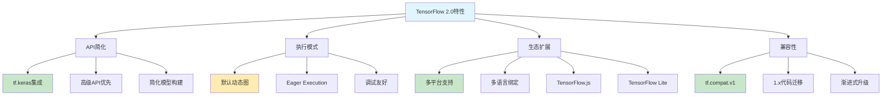

# HCIA-AI 题目分析 - TensorFlow2.0特性

## 题目内容

**问题**: 以下属于TensorFlow2.0的特性的是?

**选项**:
- A. 引入Keras接口
- B. 支持静态图机制
- C. 支持更多平台和更多语言
- D. 继续兼容Tensorflow1.x的相关模块

## 选项分析表格

| 选项 | 内容 | 正确性 | 详细分析 | 知识点 |
|------|------|--------|----------|--------|
| A | 引入Keras接口 | ✅ | TensorFlow2.0将Keras作为高级API深度集成，tf.keras成为主要的模型构建接口 | 高级API集成 |
| B | 支持静态图机制 | ❌ | TensorFlow2.0默认使用动态图(Eager Execution)，虽然仍支持静态图但不是主要特性 | 执行模式 |
| C | 支持更多平台和更多语言 | ✅ | TensorFlow2.0扩展了平台支持(移动端、Web等)和语言绑定(Python、JavaScript等) | 跨平台支持 |
| D | 继续兼容Tensorflow1.x的相关模块 | ✅ | 通过tf.compat.v1模块提供向后兼容性，支持1.x代码迁移 | 向后兼容 |

## 正确答案
**答案**: ACD

**解题思路**: 
1. TensorFlow2.0的核心改进是易用性和灵活性提升
2. Keras集成是最重要的特性，简化了模型开发
3. 默认启用动态图，而非静态图机制
4. 扩展了平台和语言支持，增强生态系统
5. 提供兼容性模块确保平滑迁移

## 概念图解

## 知识点总结

### 核心概念
- **tf.keras集成**: 高级API成为主要接口
- **动态图优先**: Eager Execution默认启用
- **跨平台扩展**: 支持移动端、Web、嵌入式等
- **向后兼容**: tf.compat.v1确保平滑迁移

### 相关技术
- **Keras API**: 简化的神经网络构建接口
- **Eager Execution**: 动态图执行模式
- **TensorFlow Lite**: 移动端和嵌入式部署
- **TensorFlow.js**: 浏览器端机器学习

### 记忆要点
- TensorFlow2.0主打"易用性"，Keras集成是核心
- 默认动态图而非静态图，更符合Python习惯
- 生态系统大幅扩展，支持更多平台和语言
- 兼容性设计确保从1.x平滑升级

## 扩展学习

### 相关文档
- TensorFlow 2.0迁移指南
- tf.keras完整教程
- Eager Execution使用指南

### 实践应用
- 模型开发最佳实践
- 1.x到2.0代码迁移
- 多平台模型部署策略