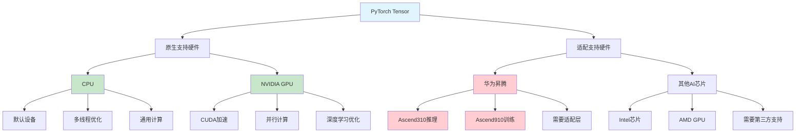

# HCIA-AI 题目分析 - PyTorch Tensor硬件支持

## 题目内容

**问题**: Pytorch提供的Tensor，可以极大地加速计算，其中的Tensor支持以下哪些硬件?

**选项**:
- A. GPU
- B. CPU
- C. Ascend310
- D. Ascend910

## 选项分析表格

| 选项 | 内容 | 正确性 | 详细分析 | 知识点 |
|------|------|--------|----------|--------|
| A | GPU | ✅ | PyTorch原生支持CUDA GPU加速，通过.cuda()或.to('cuda')可将Tensor移至GPU | GPU加速 |
| B | CPU | ✅ | PyTorch默认在CPU上创建Tensor，支持多线程CPU计算优化 | CPU计算 |
| C | Ascend310 | ❌ | Ascend310是华为昇腾推理芯片，PyTorch原生不支持，需要通过适配层或转换 | 昇腾推理芯片 |
| D | Ascend910 | ❌ | Ascend910是华为昇腾训练芯片，PyTorch原生不支持，华为提供了PyTorch适配版本 | 昇腾训练芯片 |

## 正确答案
**答案**: AB

**解题思路**: 
1. PyTorch原生支持的硬件主要是CPU和NVIDIA GPU
2. CPU是默认计算设备，所有Tensor默认在CPU上创建
3. GPU通过CUDA支持，需要安装CUDA版本的PyTorch
4. 昇腾芯片需要特殊适配，不是PyTorch原生支持的硬件
5. 华为虽然提供了昇腾版PyTorch，但这是适配版本而非原生支持

## 概念图解

## 知识点总结

### 核心概念
- **CPU支持**: PyTorch默认计算设备，支持多线程优化
- **GPU支持**: 通过CUDA实现GPU加速计算
- **设备管理**: .to()方法在不同设备间移动Tensor
- **原生vs适配**: 区分框架原生支持和第三方适配

### 相关技术
- **CUDA编程**: GPU并行计算基础
- **设备内存管理**: CPU和GPU内存的分配和传输
- **华为昇腾适配**: 通过CANN和适配层支持PyTorch
- **异构计算**: 多种计算设备的协同使用

### 记忆要点
- PyTorch原生只支持CPU和NVIDIA GPU
- 昇腾芯片需要华为提供的适配版本
- 区分"原生支持"和"适配支持"的概念
- GPU加速需要CUDA环境和对应版本PyTorch

## 扩展学习

### 相关文档
- PyTorch CUDA编程指南
- 华为昇腾PyTorch适配文档
- 异构计算最佳实践

### 实践应用
- GPU加速模型训练
- 多设备模型部署
- 昇腾平台PyTorch迁移