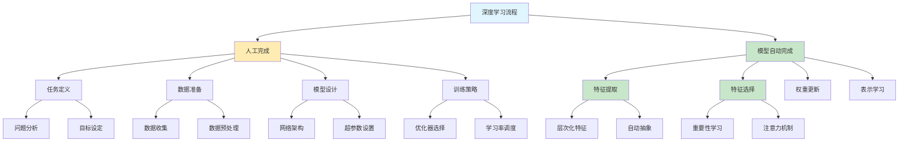

# HCIA-AI 题目分析 - 深度学习模型自动完成步骤

## 题目内容

**问题**: 深度学习中以下哪些步骤是由模型自动完成的?

**选项**:
- A. 模型训练
- B. 特征选择
- C. 分析定位任务
- D. 特征提取

## 选项分析表格

| 选项 | 内容 | 正确性 | 详细分析 | 知识点 |
|------|------|--------|----------|--------|
| A | 模型训练 | ❌ | 模型训练需要人工设置超参数、选择优化器、设计训练策略等，不是完全自动的 | 训练过程 |
| B | 特征选择 | ✅ | 深度学习模型通过反向传播自动学习哪些特征重要，无需人工特征选择 | 自动特征学习 |
| C | 分析定位任务 | ❌ | 任务定义和问题分析需要人工完成，模型无法自动理解要解决什么问题 | 任务定义 |
| D | 特征提取 | ✅ | 深度神经网络自动从原始数据中提取层次化特征，这是深度学习的核心优势 | 自动特征提取 |

## 正确答案
**答案**: BD

**解题思路**: 
1. 深度学习的核心优势是自动特征学习能力
2. 特征选择：模型通过训练自动确定重要特征
3. 特征提取：多层网络自动提取层次化特征表示
4. 模型训练：需要人工设计和调参，不是完全自动
5. 任务分析：需要人工定义问题和目标

## 概念图解

## 知识点总结

### 核心概念
- **自动特征提取**: 深度网络从原始数据学习层次化特征
- **自动特征选择**: 通过训练过程自动确定特征重要性
- **端到端学习**: 从输入到输出的自动映射学习
- **表示学习**: 自动学习数据的有效表示

### 相关技术
- **卷积神经网络**: 自动提取图像特征
- **循环神经网络**: 自动提取序列特征
- **注意力机制**: 自动选择重要信息
- **反向传播**: 自动更新网络参数

### 记忆要点
- 深度学习的"深度"体现在自动特征学习能力
- 特征工程从人工转向自动，这是深度学习的核心优势
- 模型训练和任务定义仍需要人工参与
- 区分"自动"和"人工"的边界很重要

## 扩展学习

### 相关文档
- 深度学习特征学习原理
- 自动机器学习(AutoML)发展
- 端到端学习方法论

### 实践应用
- 计算机视觉中的自动特征提取
- 自然语言处理中的表示学习
- 推荐系统中的自动特征工程