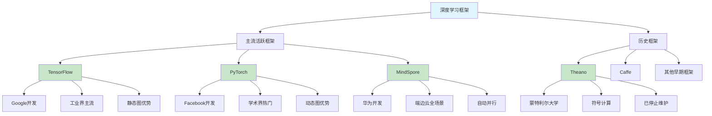

# HCIA-AI 题目分析 - 人工智能深度学习框架

## 题目内容

**问题**: 以下哪些选项是人工智能深度学习框架?

**选项**:
- A. MindSpore
- B. Pytorch
- C. Theano
- D. TensorFlow

## 选项分析表格

| 选项 | 内容 | 正确性 | 详细分析 | 知识点 |
|------|------|--------|----------|--------|
| A | MindSpore | ✅ | 华为开源的深度学习框架，支持端边云全场景AI开发 | 华为AI框架 |
| B | Pytorch | ✅ | Facebook开源的深度学习框架，以动态图和易用性著称 | 主流AI框架 |
| C | Theano | ✅ | 早期的深度学习框架，虽然已停止维护但曾是重要的深度学习工具 | 历史AI框架 |
| D | TensorFlow | ✅ | Google开源的深度学习框架，目前最流行的AI开发平台之一 | 主流AI框架 |

## 正确答案
**答案**: ABCD

**解题思路**: 
1. 深度学习框架是用于构建和训练神经网络的软件平台
2. MindSpore是华为的全场景AI框架
3. PyTorch是当前最受欢迎的研究型框架
4. Theano虽然已停止维护，但曾是重要的深度学习框架
5. TensorFlow是工业界应用最广泛的框架
6. 所有选项都属于深度学习框架范畴

## 概念图解

## 知识点总结

### 核心概念
- **深度学习框架**: 提供神经网络构建、训练、部署的软件平台
- **动态图vs静态图**: PyTorch动态图，TensorFlow传统静态图
- **全场景AI**: MindSpore支持端边云一体化开发
- **框架演进**: 从Theano到现代框架的技术发展

### 相关技术
- **自动微分**: 所有框架的核心技术
- **GPU加速**: 框架对硬件加速的支持
- **分布式训练**: 大规模模型训练能力
- **模型部署**: 从训练到生产的完整流程

### 记忆要点
- 四个选项都是深度学习框架，包括历史和现代框架
- TensorFlow和PyTorch是当前主流，各有优势
- MindSpore是华为的全场景AI解决方案
- Theano虽已停维但在深度学习发展史上很重要

## 扩展学习

### 相关文档
- 各框架官方文档和教程
- 深度学习框架对比分析
- 框架选择指南和最佳实践

### 实践应用
- 多框架模型开发经验
- 框架间模型转换
- 生产环境框架部署策略