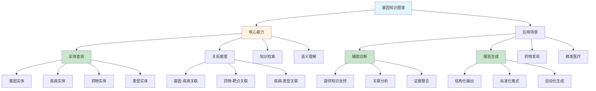

# HCIA-AI 题目分析 - 基因知识图谱能力

## 题目内容

**问题**: 基因知识图谱具备以下哪几种能力?

**选项**:
- A. 辅助病例诊断
- B. 疾病预测及诊断
- C. 基因检测报告生成
- D. 实体查询

## 选项分析表格

| 选项 | 内容 | 正确性 | 详细分析 | 知识点 |
|------|------|--------|----------|--------|
| A | 辅助病例诊断 | ✅ | 基因知识图谱通过整合基因-疾病关联信息，可以辅助医生进行病例诊断 | 医疗AI应用 |
| B | 疾病预测及诊断 | ❌ | 基因知识图谱主要提供知识支持，不直接进行疾病预测，预测需要专门的预测模型 | 知识图谱vs预测模型 |
| C | 基因检测报告生成 | ✅ | 可以基于基因数据和知识图谱中的关联信息自动生成结构化的检测报告 | 报告生成 |
| D | 实体查询 | ✅ | 知识图谱的基本功能，支持对基因、疾病、药物等实体的查询和关联分析 | 知识图谱基础功能 |

## 正确答案
**答案**: ACD

**解题思路**: 
1. 基因知识图谱是结构化的知识表示系统
2. 辅助诊断：提供基因-疾病关联知识支持
3. 疾病预测：需要专门的机器学习模型，不是知识图谱的直接功能
4. 报告生成：基于知识图谱可以自动生成标准化报告
5. 实体查询：知识图谱的核心功能之一

## 概念图解

## 知识点总结

### 核心概念
- **知识图谱**: 结构化的知识表示和存储系统
- **实体查询**: 对图谱中节点和关系的检索功能
- **辅助诊断**: 提供知识支持而非直接诊断
- **报告生成**: 基于知识自动生成标准化文档

### 相关技术
- **图数据库**: Neo4j、ArangoDB等图存储技术
- **知识抽取**: 从文献中提取结构化知识
- **语义推理**: 基于本体的逻辑推理
- **自然语言生成**: 自动报告生成技术

### 记忆要点
- 知识图谱提供知识支持，不直接做预测
- 实体查询是知识图谱的基础功能
- 辅助诊断强调"辅助"而非"替代"
- 报告生成是知识图谱的重要应用

## 扩展学习

### 相关文档
- 医疗知识图谱构建方法
- 基因本体和标准化
- 精准医疗中的AI应用

### 实践应用
- 临床决策支持系统
- 个性化医疗方案推荐
- 药物重定位研究