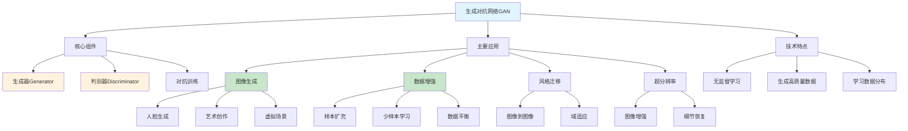

# HCIA-AI 题目分析 - 生成对抗网络应用场景

## 题目内容

**问题**: 生成对抗网络目前应用非常广泛，以下场景中可以使用此网络的是?

**选项**:
- A. 数据增强
- B. 语义分割
- C. 信息检索
- D. 图像生成

## 选项分析表格

| 选项 | 内容 | 正确性 | 详细分析 | 知识点 |
|------|------|--------|----------|--------|
| A | 数据增强 | ✅ | GAN可以生成新的训练样本，扩充数据集，特别适用于数据稀缺的场景 | 数据增强技术 |
| B | 语义分割 | ❌ | 语义分割是像素级分类任务，通常使用FCN、U-Net等架构，不是GAN的主要应用 | 计算机视觉任务 |
| C | 信息检索 | ❌ | 信息检索主要涉及相似度计算和排序，不需要生成新内容，不是GAN的应用领域 | 信息检索技术 |
| D | 图像生成 | ✅ | GAN的核心应用，可以生成逼真的图像，如人脸生成、艺术创作等 | 生成模型 |

## 正确答案
**答案**: AD

**解题思路**: 
1. GAN是生成对抗网络，核心功能是生成新数据
2. 数据增强：通过生成新样本扩充训练集
3. 语义分割：是判别任务，不需要生成功能
4. 信息检索：是检索匹配任务，不涉及生成
5. 图像生成：GAN的经典应用场景

## 概念图解

## 知识点总结

### 核心概念
- **生成对抗网络**: 通过生成器和判别器的对抗训练生成新数据
- **数据增强**: 通过生成新样本扩充训练数据集
- **图像生成**: 从噪声或条件输入生成逼真图像
- **对抗训练**: 生成器和判别器相互博弈的训练过程

### 相关技术
- **DCGAN**: 深度卷积生成对抗网络
- **StyleGAN**: 高质量人脸生成
- **CycleGAN**: 无配对图像转换
- **Pix2Pix**: 条件图像生成

### 记忆要点
- GAN主要用于生成任务，不适用于分类或检索
- 数据增强是GAN的重要应用，解决数据稀缺问题
- 图像生成是GAN的经典应用场景
- 语义分割和信息检索不是GAN的主要应用领域

## 扩展学习

### 相关文档
- GAN原理和变种模型
- 数据增强技术对比
- 生成模型评估指标

### 实践应用
- 医疗图像数据增强
- 游戏角色和场景生成
- 艺术创作和设计辅助