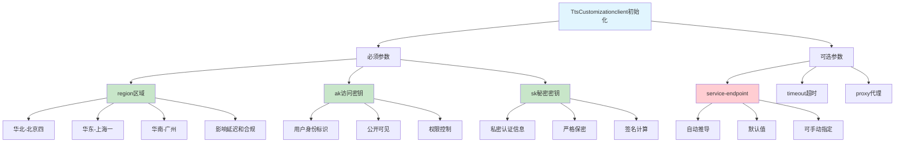

# HCIA-AI 题目分析 - 华为云语音合成API初始化参数

## 题目内容

**问题**: 调用华为云语音合成python API时，需要初始化客户端参数，主要通过TtsCustomizationclient函数完成。以下初始化参数中，必须项有哪几项?

**选项**:
- A. service-endpoint
- B. region
- C. sk
- D. ak

## 选项分析表格

| 选项 | 内容 | 正确性 | 详细分析 | 知识点 |
|------|------|--------|----------|--------|
| A | service-endpoint | ❌ | 服务端点通常有默认值或可以通过region自动推导，不是必须显式指定的参数 | API端点配置 |
| B | region | ✅ | 区域参数是必须的，用于确定服务的地理位置和数据中心，影响延迟和合规性 | 华为云区域 |
| C | sk | ✅ | Secret Key，华为云API认证的必要参数，与AK配对使用进行身份验证 | 安全认证 |
| D | ak | ✅ | Access Key，华为云API认证的必要参数，用于标识调用者身份 | 安全认证 |

## 正确答案
**答案**: BCD

**解题思路**: 
1. 华为云API调用需要身份认证和服务定位
2. region：必须指定服务区域
3. ak/sk：访问密钥对，用于API认证，缺一不可
4. service-endpoint：通常可以通过region自动确定，不是必须参数
5. 认证三要素：region + ak + sk

## 概念图解

## 知识点总结

### 核心概念
- **Region区域**: 华为云服务的地理位置标识
- **AK/SK密钥对**: 华为云API认证的核心机制
- **Service Endpoint**: 服务访问端点，可自动推导
- **客户端初始化**: API调用前的必要配置步骤

### 相关技术
- **华为云IAM**: 身份与访问管理服务
- **API签名**: 基于AK/SK的请求签名机制
- **区域选择**: 影响性能和数据合规的重要因素
- **SDK封装**: 简化API调用的开发工具包

### 记忆要点
- 华为云API认证必须三要素：region + ak + sk
- service-endpoint通常可以自动推导，不是必须参数
- AK可以公开，SK必须严格保密
- region选择影响服务性能和数据合规性

## 扩展学习

### 相关文档
- 华为云API认证机制详解
- 语音合成服务开发指南
- 华为云SDK使用教程

### 实践应用
- 语音合成应用开发
- 多区域服务部署
- API安全最佳实践