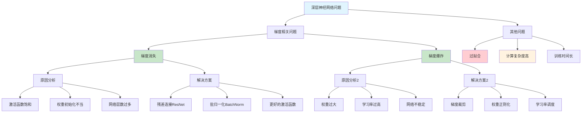

# HCIA-AI 题目分析 - 神经网络深度过深问题

## 题目内容

**问题**: 神经网络深度过深容易出现以下哪一种问题?

**选项**:
- A. 梯度消失
- B. 梯度爆炸
- C. 训练数据丢失
- D. 模型欠拟合

## 选项分析表格

| 选项 | 内容 | 正确性 | 详细分析 | 知识点 |
|------|------|--------|----------|--------|
| A | 梯度消失 | ✅ | 深层网络中梯度在反向传播过程中逐层衰减，导致前层参数难以更新，这是深度网络的经典问题 | 梯度消失问题 |
| B | 梯度爆炸 | ✅ | 深层网络中梯度可能在反向传播过程中指数级增长，导致参数更新过大，训练不稳定 | 梯度爆炸问题 |
| C | 训练数据丢失 | ❌ | 网络深度不会导致训练数据丢失，数据丢失是数据管理问题，与网络架构无关 | 数据管理 |
| D | 模型欠拟合 | ❌ | 深层网络通常具有更强的表达能力，更容易过拟合而不是欠拟合 | 拟合问题 |

## 正确答案
**答案**: AB

**解题思路**: 
1. 深层神经网络的主要挑战是梯度传播问题
2. 梯度消失：激活函数饱和导致梯度逐层衰减
3. 梯度爆炸：权重过大导致梯度指数级增长
4. 训练数据丢失：与网络深度无关
5. 模型欠拟合：深层网络表达能力强，更易过拟合

## 概念图解

## 知识点总结

### 核心概念
- **梯度消失**: 深层网络中梯度在反向传播时逐层衰减
- **梯度爆炸**: 梯度在反向传播时指数级增长
- **反向传播**: 神经网络参数更新的核心算法
- **深度网络**: 具有多个隐藏层的神经网络

### 相关技术
- **残差网络ResNet**: 通过跳跃连接解决梯度消失
- **批归一化**: 稳定训练过程，缓解梯度问题
- **梯度裁剪**: 限制梯度范数，防止梯度爆炸
- **LSTM/GRU**: 解决RNN中的梯度消失问题

### 记忆要点
- 深层网络的主要问题是梯度传播困难
- 梯度消失和爆炸都可能在深层网络中出现
- 训练数据丢失与网络深度无关
- 深层网络表达能力强，更容易过拟合而非欠拟合

## 扩展学习

### 相关文档
- 深度学习中的梯度问题分析
- ResNet和DenseNet架构原理
- 神经网络训练技巧和最佳实践

### 实践应用
- 深度卷积神经网络设计
- 循环神经网络优化
- 大规模深度模型训练