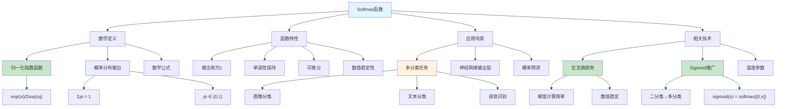

# HCIA-AI 题目分析 - softmax函数描述

## 题目内容

**问题**: softmax函数在分类任务中经常被使用，下列关于softmax函数的描述，哪些选项是正确的?

**选项**:
- A. 是一分类函数sigmoid的推广
- B. softmax函数又称作归一化指数函数
- C. Softmax回归模型是解决二分类回归问题的算法
- D. softmax函数经常与交叉熵损失函数联合使用

## 选项分析表格

| 选项 | 内容 | 正确性 | 详细分析 | 知识点 |
|------|------|--------|----------|--------|
| A | 是一分类函数sigmoid的推广 | ✅ | Softmax是sigmoid函数在多分类问题上的推广，sigmoid用于二分类，softmax用于多分类 | 激活函数关系 |
| B | softmax函数又称作归一化指数函数 | ✅ | Softmax通过指数函数和归一化操作将任意实数向量转换为概率分布 | 函数定义 |
| C | Softmax回归模型是解决二分类回归问题的算法 | ❌ | Softmax回归主要用于多分类问题，二分类通常使用逻辑回归(sigmoid) | 应用场景 |
| D | softmax函数经常与交叉熵损失函数联合使用 | ✅ | 在多分类任务中，softmax输出概率分布，交叉熵损失函数计算预测与真实标签的差异 | 损失函数组合 |

## 正确答案
**答案**: ABD

**解题思路**: 
1. Softmax是sigmoid在多分类上的自然推广
2. 归一化指数函数是softmax的别名，描述了其数学本质
3. Softmax主要用于多分类，不是二分类的首选
4. Softmax+交叉熵是多分类的经典组合
5. 选项C错误，因为softmax主要解决多分类问题

## 概念图解

## 知识点总结

### 核心概念
- **Softmax函数**: 将任意实数向量转换为概率分布的函数
- **归一化指数函数**: Softmax的数学本质描述
- **Sigmoid推广**: 从二分类扩展到多分类的自然演进
- **概率输出**: 输出值在[0,1]区间且和为1

### 相关技术
- **交叉熵损失**: 与softmax配合的标准损失函数
- **温度参数**: 控制softmax输出分布的锐度
- **数值稳定技巧**: 防止指数运算溢出的技术
- **梯度计算**: softmax+交叉熵的梯度形式简洁

### 记忆要点
- Softmax是sigmoid的多分类推广
- "归一化指数函数"是softmax的正式名称
- 主要用于多分类，不是二分类的首选
- 与交叉熵损失函数是经典搭配

## 扩展学习

### 相关文档
- 激活函数对比分析
- 多分类问题解决方案
- 损失函数选择指南

### 实践应用
- 图像分类网络设计
- 自然语言处理分类任务
- 推荐系统概率预测