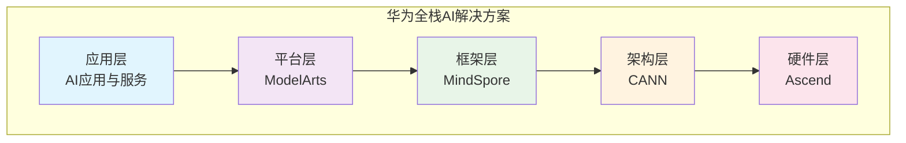

# HCIA-AI 题目分析 - 华为全栈AI解决方案

## 题目内容

**问题**: 以下哪几个方面属于华为的全栈AI解决方案？

**选项**:
- A. Ascend
- B. CANN
- C. ModelArts
- D. MindSpore

## 选项分析表格

| 选项 | 内容 | 正确性 | 详细分析 | 知识点 |
|------|------|--------|----------|--------|
| A | Ascend | ✅ | Ascend是华为自研的AI处理器系列，包括昇腾310、昇腾910等，是华为全栈AI解决方案的硬件基础，提供强大的AI算力支撑 | AI芯片硬件 |
| B | CANN | ✅ | CANN（Compute Architecture for Neural Networks）是华为针对AI芯片的异构计算架构，是连接上层AI框架和底层昇腾处理器的关键软件层 | AI计算架构 |
| C | ModelArts | ✅ | ModelArts是华为云一站式AI开发平台，提供数据处理、模型训练、模型部署等全流程AI开发服务，是华为全栈AI解决方案的平台层 | AI开发平台 |
| D | MindSpore | ✅ | MindSpore是华为自研的AI计算框架，支持端、边、云全场景，提供统一的AI开发体验，是华为全栈AI解决方案的框架层 | AI计算框架 |

## 正确答案
**答案**: ABCD

**解题思路**: 
1. 华为全栈AI解决方案是一个完整的AI技术栈，从底层硬件到上层应用全覆盖
2. Ascend提供AI算力硬件基础
3. CANN提供异构计算架构支撑
4. MindSpore提供AI开发框架
5. ModelArts提供云端AI开发平台
6. 四个选项都是华为全栈AI解决方案的重要组成部分

## 概念图解

## 知识点总结

### 核心概念
- **全栈AI解决方案**: 从芯片到应用的完整AI技术栈
- **昇腾处理器**: 华为自研AI芯片，提供强大算力
- **CANN**: 异构计算架构，连接框架与硬件
- **MindSpore**: 全场景AI框架，支持端边云
- **ModelArts**: 一站式AI开发平台

### 相关技术
- **昇腾310**: 推理芯片，适用于边缘计算
- **昇腾910**: 训练芯片，适用于数据中心
- **达芬奇架构**: 昇腾处理器的核心架构
- **华为云**: ModelArts的云服务载体

### 记忆要点
- **硬件基础**: Ascend芯片提供算力
- **软件栈**: CANN + MindSpore + ModelArts
- **全场景**: 端、边、云全覆盖
- **自主可控**: 华为完全自研的AI技术栈

## 扩展学习

### 相关文档
- 华为昇腾官方文档
- MindSpore开发者指南
- ModelArts用户手册
- CANN开发指南

### 实践应用
- 使用ModelArts进行模型训练
- MindSpore框架开发AI应用
- 昇腾硬件部署推理服务
- CANN算子开发与优化