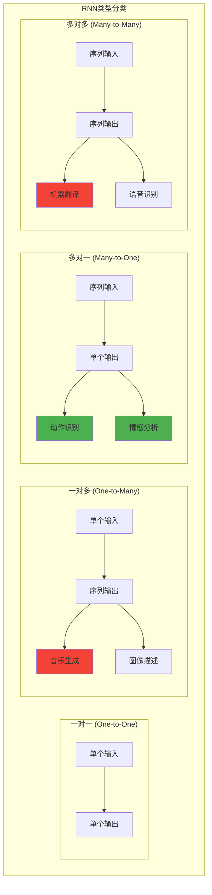

# HCIA-AI 题目分析 - 循环神经网络多对一类型

## 题目内容

**问题**: 以下哪些项属于循环神经网络中多对一的类型？

**选项**:
- A. 音乐生成
- B. 动作识别
- C. 机器翻译
- D. 情感分析

## 选项分析表格

| 选项 | 内容 | 正确性 | 详细分析 | 知识点 |
|------|------|--------|----------|--------|
| A | 音乐生成 | ❌ | 音乐生成是一对多（one-to-many）类型，输入一个种子或主题，输出一段音乐序列。这是序列生成任务，不是多对一 | 序列生成 |
| B | 动作识别 | ✅ | 动作识别是多对一（many-to-one）类型，输入是视频帧序列或传感器数据序列，输出是单一的动作类别标签 | 序列分类 |
| C | 机器翻译 | ❌ | 机器翻译是多对多（many-to-many）类型，输入是源语言句子序列，输出是目标语言句子序列，两者都是序列 | 序列到序列 |
| D | 情感分析 | ✅ | 情感分析是多对一（many-to-one）类型，输入是文本序列（单词序列），输出是单一的情感标签（正面/负面/中性） | 文本分类 |

## 正确答案
**答案**: BD

**解题思路**: 
1. 理解RNN的四种基本类型：一对一、一对多、多对一、多对多
2. 多对一（many-to-one）：输入是序列，输出是单个值
3. 动作识别：视频帧序列 → 动作类别
4. 情感分析：文本序列 → 情感标签
5. 音乐生成是一对多，机器翻译是多对多

## 概念图解

## 知识点总结

### 核心概念
- **多对一（Many-to-One）**: 输入序列，输出单个值
- **序列分类**: 将整个序列映射到一个类别标签
- **时序特征提取**: 从序列中提取全局特征
- **最后时刻输出**: 通常使用RNN最后一个时刻的隐状态

### 相关技术
- **LSTM/GRU**: 解决长序列依赖问题
- **注意力机制**: 关注序列中的重要部分
- **池化操作**: 全局平均池化或最大池化
- **双向RNN**: 同时考虑前向和后向信息

### 记忆要点
- **动作识别**: 视频序列 → 动作类别（多对一）
- **情感分析**: 文本序列 → 情感标签（多对一）
- **音乐生成**: 种子 → 音乐序列（一对多）
- **机器翻译**: 源语言 → 目标语言（多对多）

## 扩展学习

### 相关文档
- RNN基础理论与应用
- LSTM和GRU网络结构
- 序列建模技术指南
- 深度学习序列处理方法

### 实践应用
- 使用LSTM进行情感分析
- 基于RNN的动作识别系统
- 视频理解与分类
- 文本分类与情感挖掘