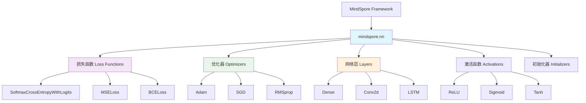

# HCIA-AI 题目分析 - MindSpore min函数

## 题目内容

**问题**: 7. 在mindspore的python API中，mindspore.() 可以用来定义损失函数、优化器以及其他构建网络的计算单元。(填空)

**选项**:
- 填空答案: nn

## 选项分析表格

| 选项 | 内容 | 正确性 | 详细分析 | 知识点 |
|------|------|--------|----------|--------|
| nn | mindspore.nn | ✅ | mindspore.nn是MindSpore框架中的神经网络模块，提供了构建神经网络所需的各种组件。包括损失函数(如SoftmaxCrossEntropyWithLogits)、优化器(如Adam、SGD)、激活函数、网络层等。这是MindSpore中最核心的模块之一，用于定义和构建深度学习模型的各个组件。 | MindSpore框架、神经网络模块 |

## 正确答案
**答案**: nn

**解题思路**: 
1. 题目询问MindSpore中用于定义损失函数、优化器等网络组件的模块
2. 在MindSpore框架中，nn(neural network)模块专门用于神经网络相关组件
3. mindspore.nn包含了构建深度学习模型所需的所有基础组件
4. 这是MindSpore API设计的核心模块

## 概念图解



## 知识点总结

### 核心概念
- **mindspore.nn**: MindSpore的神经网络模块，提供构建深度学习模型的基础组件
- **模块化设计**: 将不同功能组件分类管理，便于使用和维护
- **API一致性**: 提供统一的接口风格，降低学习成本

### nn模块主要组件

#### 1. 损失函数 (Loss Functions)
```python
import mindspore.nn as nn

# 交叉熵损失
loss_fn = nn.SoftmaxCrossEntropyWithLogits(sparse=True, reduction='mean')

# 均方误差损失
mse_loss = nn.MSELoss()

# 二元交叉熵损失
bce_loss = nn.BCELoss()
```

#### 2. 优化器 (Optimizers)
```python
# Adam优化器
optimizer = nn.Adam(params=net.trainable_params(), learning_rate=0.001)

# SGD优化器
sgd_optimizer = nn.SGD(params=net.trainable_params(), learning_rate=0.01)

# RMSprop优化器
rmsprop_optimizer = nn.RMSprop(params=net.trainable_params(), learning_rate=0.001)
```

#### 3. 网络层 (Layers)
```python
# 全连接层
dense = nn.Dense(in_channels=784, out_channels=10)

# 卷积层
conv2d = nn.Conv2d(in_channels=3, out_channels=64, kernel_size=3)

# LSTM层
lstm = nn.LSTM(input_size=100, hidden_size=128, num_layers=2)
```

#### 4. 激活函数 (Activation Functions)
```python
# ReLU激活函数
relu = nn.ReLU()

# Sigmoid激活函数
sigmoid = nn.Sigmoid()

# Tanh激活函数
tanh = nn.Tanh()
```

### 设计特点
- **统一接口**: 所有组件都遵循相似的API设计模式
- **可组合性**: 不同组件可以灵活组合构建复杂网络
- **参数管理**: 自动管理网络参数的初始化和更新
- **设备无关**: 支持CPU和GPU等不同计算设备

### 与其他框架对比
| 框架 | 神经网络模块 | 特点 |
|------|-------------|------|
| MindSpore | mindspore.nn | 统一的nn模块，组件丰富 |
| PyTorch | torch.nn | 类似设计，广泛使用 |
| TensorFlow | tf.keras.layers | 基于Keras的高级API |
| PaddlePaddle | paddle.nn | 与PyTorch类似的设计 |

### 记忆要点
- nn = neural network = 神经网络模块
- mindspore.nn是MindSpore的核心模块
- 包含损失函数、优化器、网络层等所有组件
- 遵循统一的API设计模式

## 扩展学习

### 高级特性
- **自定义层**: 继承nn.Cell创建自定义网络层
- **模型保存**: 使用nn.Cell的save_checkpoint功能
- **模型加载**: 使用load_checkpoint加载预训练模型
- **参数初始化**: 使用nn.initializer进行参数初始化

### 实际应用示例
```python
import mindspore.nn as nn
import mindspore as ms

class SimpleNet(nn.Cell):
    def __init__(self, num_classes=10):
        super(SimpleNet, self).__init__()
        self.flatten = nn.Flatten()
        self.dense1 = nn.Dense(784, 128)
        self.relu = nn.ReLU()
        self.dense2 = nn.Dense(128, num_classes)
    
    def construct(self, x):
        x = self.flatten(x)
        x = self.dense1(x)
        x = self.relu(x)
        x = self.dense2(x)
        return x

# 创建网络
net = SimpleNet()

# 定义损失函数和优化器
loss_fn = nn.SoftmaxCrossEntropyWithLogits(sparse=True)
optimizer = nn.Adam(net.trainable_params(), learning_rate=0.001)
```

### 性能优化
- **图模式**: 使用静态图模式提高执行效率
- **混合精度**: 使用nn.TrainOneStepWithLossScaleCell进行混合精度训练
- **并行训练**: 支持数据并行和模型并行
- **内存优化**: 自动内存管理和优化

### 调试和监控
- **参数查看**: 使用net.parameters_dict()查看网络参数
- **梯度检查**: 监控梯度变化情况
- **损失监控**: 实时监控训练损失变化
- **可视化**: 结合MindInsight进行训练过程可视化