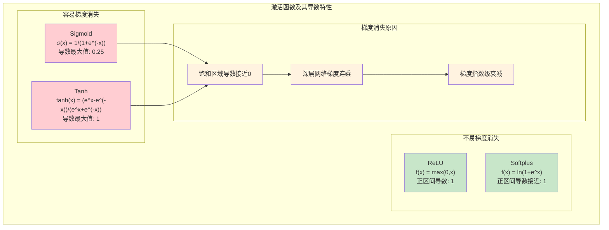

# HCIA-AI 题目分析 - 激活函数梯度消失问题

## 题目内容

**问题**: 以下哪些激活函数容易产生梯度消失问题？

**选项**:
- A. ReLU
- B. Softplus
- C. Tanh
- D. Sigmoid

## 选项分析表格

| 选项 | 内容 | 正确性 | 详细分析 | 知识点 |
|------|------|--------|----------|--------|
| A | ReLU | ❌ | ReLU函数在正区间梯度为1，不会产生梯度消失问题。但在负区间梯度为0，可能导致神经元死亡问题，这与梯度消失不同 | 线性整流函数 |
| B | Softplus | ❌ | Softplus函数是ReLU的平滑版本，梯度在正区间接近1，在负区间虽然会衰减但不会完全消失，相比Sigmoid和Tanh更不容易产生梯度消失 | 平滑激活函数 |
| C | Tanh | ✅ | Tanh函数的导数最大值为1（在x=0处），在饱和区域（x很大或很小时）导数接近0，在深层网络中容易导致梯度消失问题 | 双曲正切函数 |
| D | Sigmoid | ✅ | Sigmoid函数的导数最大值仅为0.25（在x=0处），在饱和区域导数接近0，是最容易产生梯度消失问题的激活函数之一 | S型函数 |

## 正确答案
**答案**: CD

**解题思路**: 
1. 梯度消失问题的根本原因是激活函数导数过小
2. 在反向传播中，梯度是各层导数的连乘
3. Sigmoid导数最大值0.25，Tanh导数最大值1，都在饱和区域导数接近0
4. ReLU在正区间导数为1，Softplus导数在正区间接近1
5. 因此Sigmoid和Tanh更容易产生梯度消失

## 概念图解

## 知识点总结

### 核心概念
- **梯度消失**: 深层网络中梯度逐层衰减至接近0
- **饱和函数**: 在输入很大或很小时输出趋于常数
- **导数上界**: 激活函数导数的最大值决定梯度传播能力
- **链式法则**: 反向传播中梯度是各层导数的连乘

### 相关技术
- **ReLU系列**: ReLU、Leaky ReLU、ELU等
- **残差连接**: 通过跳跃连接缓解梯度消失
- **批量归一化**: 规范化输入分布
- **梯度裁剪**: 防止梯度爆炸

### 记忆要点
- **Sigmoid导数最大0.25**: 最容易梯度消失
- **Tanh导数最大1**: 比Sigmoid好但仍易梯度消失
- **ReLU正区间导数1**: 有效缓解梯度消失
- **饱和区域是关键**: 导数接近0导致梯度消失

## 扩展学习

### 相关文档
- 深度学习中的梯度消失问题
- 激活函数选择指南
- 残差网络原理与应用
- 批量归一化技术详解

### 实践应用
- 深层网络激活函数选择
- 梯度消失问题诊断
- 网络架构优化策略
- 训练稳定性改进方法