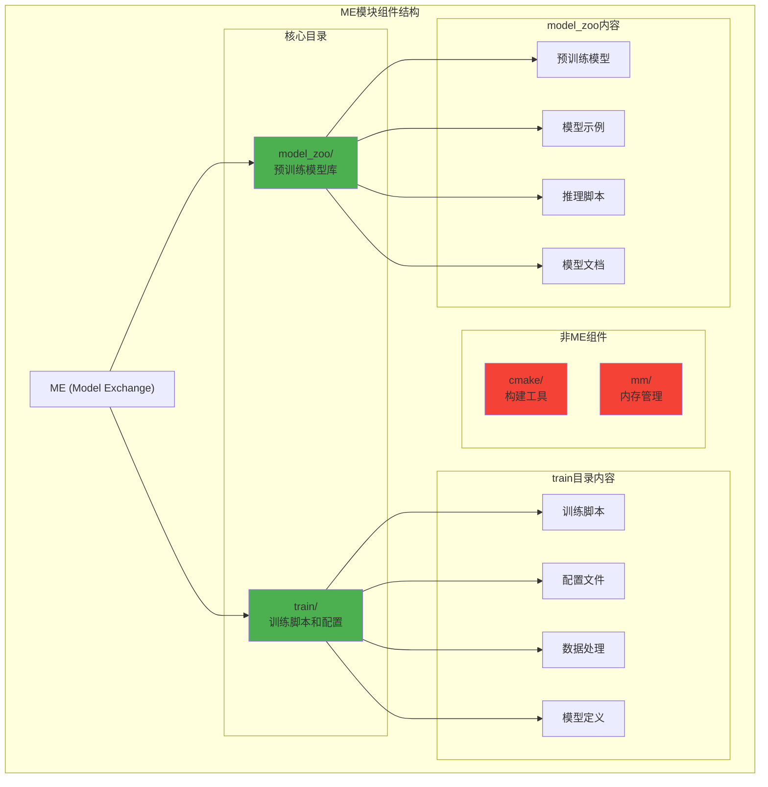

# HCIA-AI 题目分析 - ME模块组件包含目录

## 题目内容

**问题**: 哪些目录是ME模块组件包含的？

**选项**:
- A. train
- B. cmake
- C. model_zoo
- D. mm

## 选项分析表格

| 选项 | 内容 | 正确性 | 详细分析 | 知识点 |
|------|------|--------|----------|--------|
| A | train | ✅ | train目录是ME（Model Exchange）模块的核心组件，包含模型训练相关的脚本、配置文件和训练流程代码 | 模型训练 |
| B | cmake | ❌ | cmake是构建工具目录，用于编译C++代码，不是ME模块的特定组件，而是通用的构建系统目录 | 构建工具 |
| C | model_zoo | ✅ | model_zoo目录包含预训练模型库，是ME模块的重要组成部分，提供各种预训练模型供用户使用和参考 | 模型库 |
| D | mm | ❌ | mm目录通常指内存管理（Memory Management）相关代码，不是ME模块的标准组件目录 | 内存管理 |

## 正确答案
**答案**: AC

**解题思路**: 
1. ME（Model Exchange）模块是华为MindSpore中的模型交换组件
2. train目录包含训练相关的代码和脚本
3. model_zoo目录包含预训练模型和示例
4. cmake是通用构建工具，不特定于ME模块
5. mm通常指内存管理，不是ME模块组件

## 概念图解

## 知识点总结

### 核心概念
- **ME模块**: MindSpore中的模型交换组件
- **train目录**: 包含训练相关的所有代码和配置
- **model_zoo**: 预训练模型库和示例集合
- **模块化设计**: 按功能划分的目录结构

### 相关技术
- **MindSpore框架**: 华为自研AI计算框架
- **模型训练流程**: 数据加载、模型定义、训练循环
- **预训练模型**: 在大数据集上预先训练的模型
- **模型交换**: 不同平台间的模型转换和部署

### 记忆要点
- **train目录**: ME模块的训练组件
- **model_zoo**: ME模块的模型库组件
- **cmake**: 通用构建工具，非ME特有
- **mm**: 内存管理，非ME组件

## 扩展学习

### 相关文档
- MindSpore ME模块官方文档
- 模型训练最佳实践
- 预训练模型使用指南
- MindSpore目录结构说明

### 实践应用
- 使用train目录进行模型训练
- 从model_zoo获取预训练模型
- 自定义训练脚本开发
- 模型库扩展和维护