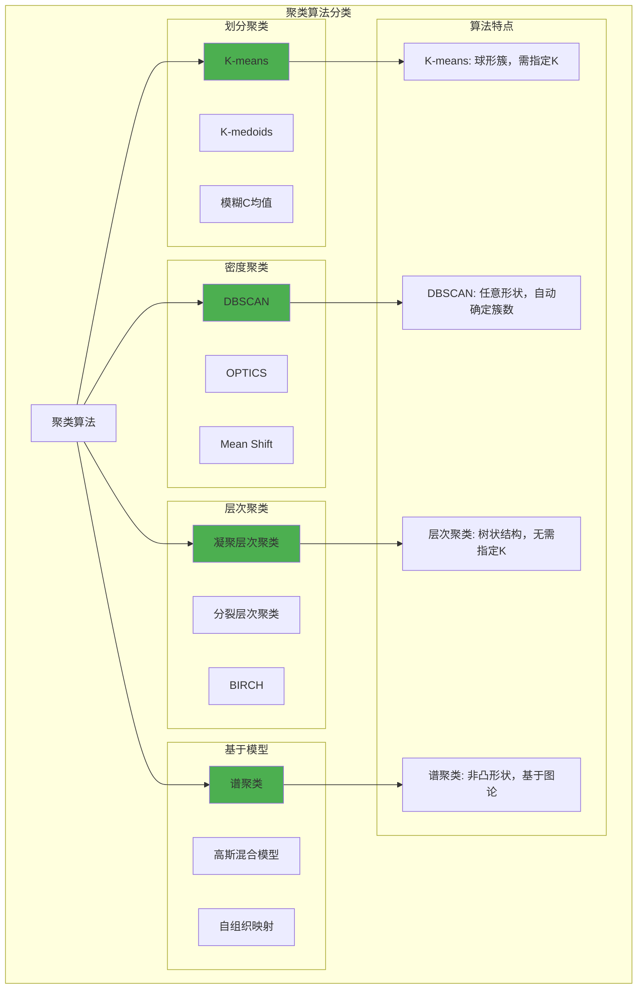

# HCIA-AI 题目分析 - 常见聚类算法

## 题目内容

**问题**: 常见的聚类算法有哪些？

**选项**:
- A. 密度聚类
- B. 层次聚类
- C. 谱聚类
- D. Kmeans

## 选项分析表格

| 选项 | 内容 | 正确性 | 详细分析 | 知识点 |
|------|------|--------|----------|--------|
| A | 密度聚类 | ✅ | 密度聚类是基于密度的聚类方法，典型代表是DBSCAN算法，能够发现任意形状的簇并处理噪声点，是常见的聚类算法类型 | 基于密度聚类 |
| B | 层次聚类 | ✅ | 层次聚类包括凝聚层次聚类和分裂层次聚类，通过构建树状结构来表示数据的层次关系，是经典的聚类算法类型 | 层次结构聚类 |
| C | 谱聚类 | ✅ | 谱聚类基于图论和线性代数，通过构建相似性图并分析其拉普拉斯矩阵的特征向量来进行聚类，适合处理非凸形状的簇 | 基于图论聚类 |
| D | Kmeans | ✅ | K-means是最经典的聚类算法之一，基于距离的划分聚类方法，通过迭代优化簇中心来最小化簇内平方和，应用最为广泛 | 划分聚类 |

## 正确答案
**答案**: ABCD

**解题思路**: 
1. 聚类算法按原理可分为多种类型
2. 密度聚类（如DBSCAN）基于数据点密度
3. 层次聚类构建树状聚类结构
4. 谱聚类基于图论和矩阵分解
5. K-means是最基础的划分聚类算法
6. 四个选项都是常见的聚类算法类型

## 概念图解

## 知识点总结

### 核心概念
- **划分聚类**: 将数据分为K个不重叠的簇
- **层次聚类**: 构建树状的聚类层次结构
- **密度聚类**: 基于数据点密度进行聚类
- **谱聚类**: 基于图的拉普拉斯矩阵特征分解

### 相关技术
- **距离度量**: 欧氏距离、曼哈顿距离、余弦距离
- **相似性度量**: 高斯核、KNN图、ε-邻域
- **优化算法**: EM算法、梯度下降、特征分解
- **评估指标**: 轮廓系数、调整兰德指数、DB指数

### 记忆要点
- **K-means**: 最基础，需要指定簇数K
- **DBSCAN**: 基于密度，能处理噪声和任意形状
- **层次聚类**: 产生树状结构，不需要预设簇数
- **谱聚类**: 适合非凸形状，计算复杂度较高

## 扩展学习

### 相关文档
- 聚类算法理论基础
- scikit-learn聚类模块
- 聚类算法性能比较
- 聚类结果评估方法

### 实践应用
- 客户细分与市场分析
- 图像分割与计算机视觉
- 基因序列分析
- 社交网络社区发现