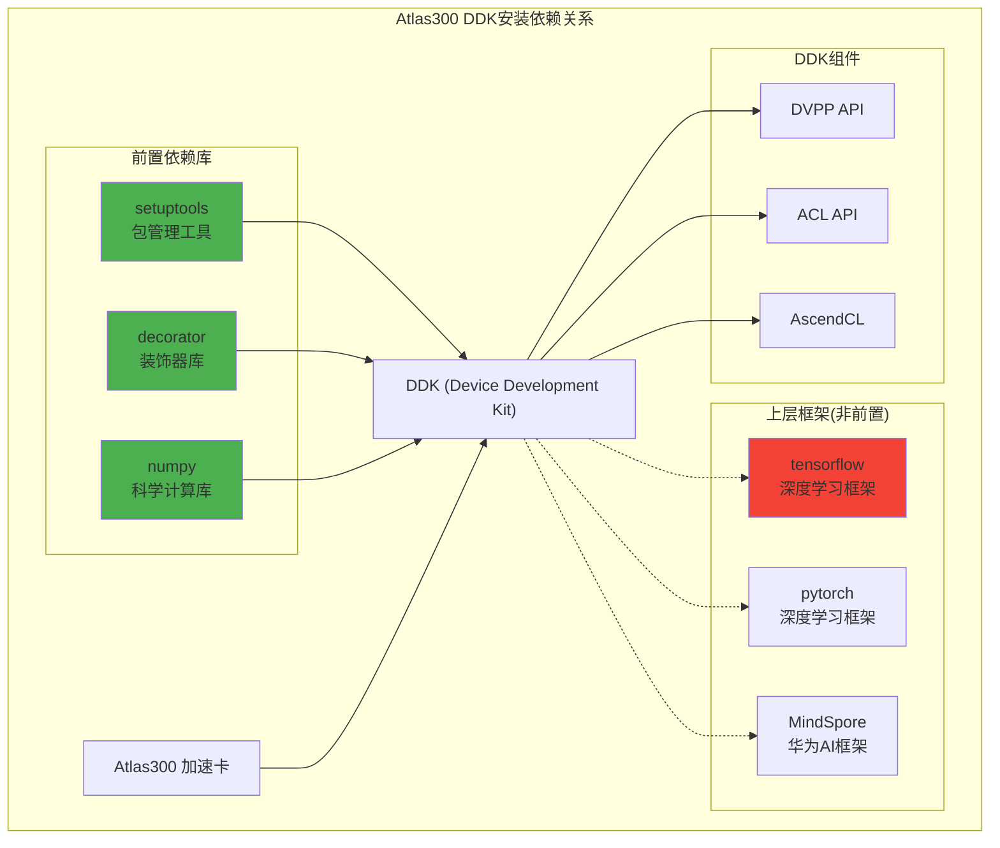

# HCIA-AI 题目分析 - Atlas300安装DDK前置库

## 题目内容

**问题**: 以下哪些库是在装有Atlas300(3000)加速卡的服务器中安装DDK(Device Development Kit)之前需要安装的？

**选项**:
- A. decorator
- B. setuptools
- C. numpy
- D. tensorflow

## 选项分析表格

| 选项 | 内容 | 正确性 | 详细分析 | 知识点 |
|------|------|--------|----------|--------|
| A | decorator | ✅ | decorator是Python装饰器库，是DDK开发环境的基础依赖之一，用于函数装饰和代码增强，在Atlas开发中经常用到 | Python基础库 |
| B | setuptools | ✅ | setuptools是Python包管理和分发工具，是安装DDK和其他Python包的基础工具，必须预先安装 | Python包管理 |
| C | numpy | ✅ | numpy是科学计算基础库，提供多维数组和数学函数，是AI开发的核心依赖，DDK中的数据处理离不开numpy | 科学计算库 |
| D | tensorflow | ❌ | tensorflow是深度学习框架，虽然可以与Atlas配合使用，但不是DDK安装的前置依赖，DDK本身是底层开发工具包 | 深度学习框架 |

## 正确答案
**答案**: ABC

**解题思路**: 
1. DDK是Atlas系列AI处理器的设备开发工具包
2. decorator提供Python装饰器功能，是基础依赖
3. setuptools是Python包安装的基础工具
4. numpy是科学计算和数据处理的核心库
5. tensorflow是上层框架，不是DDK的前置依赖

## 概念图解

## 知识点总结

### 核心概念
- **DDK**: Device Development Kit，设备开发工具包
- **Atlas300**: 华为昇腾AI推理卡
- **前置依赖**: 安装目标软件前必须先安装的库
- **Python生态**: 基础库、科学计算库、深度学习框架的层次关系

### 相关技术
- **setuptools**: Python包的构建、分发和安装
- **decorator**: Python装饰器模式实现
- **numpy**: 多维数组和数学运算
- **ACL**: Ascend Computing Language

### 记忆要点
- **基础工具**: setuptools是包管理基础
- **功能增强**: decorator提供装饰器功能
- **数据处理**: numpy是科学计算核心
- **框架区分**: tensorflow是上层框架，非前置依赖

## 扩展学习

### 相关文档
- Atlas300产品文档
- DDK开发指南
- 昇腾AI处理器开发文档
- Python依赖管理最佳实践

### 实践应用
- Atlas300环境搭建
- DDK应用开发
- AI推理应用部署
- 昇腾生态开发